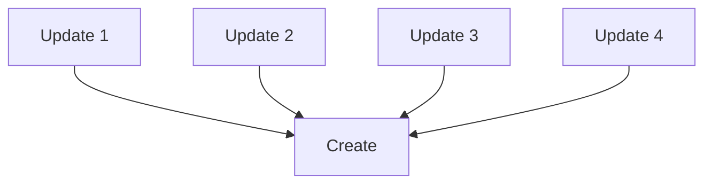
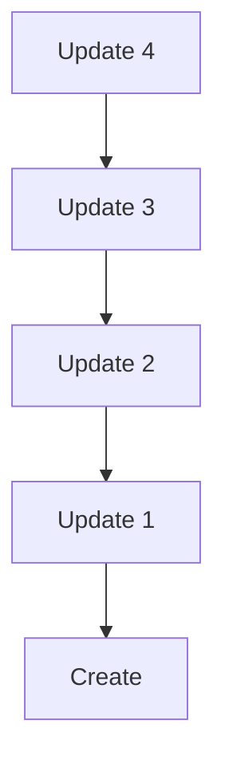

An **entry** is structured data written as a blob to an agent's source chain via an **entry creation action**, which can either be a `Create` or `Update` action. It can be updated or deleted. Although entry data exists as its own entity on a DHT, its associated entry creation action is semantically considered part of it and is stored along with it. This allows separate writes of the same entry data to be distinguished from each other.

## Define an entry type

An entry type can be any Rust struct or enum that `serde` can serialize and deserialize. To define an `EntryType`, use the [`hdk_entry_helper`](https://docs.rs/hdi/latest/hdi/attr.hdk_entry_helper.html) macro:

```rust
use hdi::prelude::*;

#[hdk_entry_helper]
pub struct Movie {
  title: String,
  director: String,
  imdb_id: Option<String>,
  release_date: Timestamp,
  box_office_revenue: u128,
}
```

This implements a host of [`TryFrom` conversions](https://docs.rs/hdi/latest/src/hdi/entry.rs.html#120-209) that your type is expected to implement.

In order to dispatch validation to the proper integrity zome, Holochain needs to know about all the entry types that your integrity zome defines. This is done by implementing a callback in your zome called `entry_defs`, but you can use the [`hdi::prelude::hdk_entry_defs`](https://docs.rs/hdi/latest/hdi/prelude/attr.hdk_entry_defs.html) macro to do this easily:

```rust
use hdi::prelude::*;

#[hdk_entry_defs]
enum EntryTypes {
  Movie(Movie),
  // other types...
}
```

Each variant in the enum holds the Rust type that defines the shape of the entry, and is implicitly marked with an `entry_def` proc macro which, if you specify it explicitly, lets you configure the given entry type further:

* An entry type can be configured as **private**, which means that it's never published to the DHT, but exists only on the author's source chain. To do this, use a `visibility = "private"` argument.
* A public entry type can be configured to expect a certain number of **required validations**, which is the number of [validation receipts](/references/glossary/#validation-receipt) that an author tries to collect from authorities before they consider their entry published on the DHT. To do this, use a `required_validations = <num>` argument.
* You can override the name of an entry type, which defaults to the name of the enum variant.

```rust
use hdi::prelude::*;

#[hdk_entry_defs]
enum EntryTypes {
    #[entry_def(name = "moovee", required_validations = 7, )]
    Movie(Movie),

    // You can reuse your Rust type in another entry type if you like. In this
    // example, `HomeMovie` also (de)serializes to/from the `Movie` struct, but
    // is actually a different entry type with different visibility, and can be
    // subjected to different validation rules.
    #[entry_def(visibility = "private", )]
    HomeMovie(Movie),
}
```

This macro doesn't just generate the `entry_defs` callback for you. It also gives you an enum that you can use later when you're storing app data. This is important because, under the hood, an entry type consists of two bytes -- an integrity zome index and an entry def index. These are required whenever you want to write an entry. Instead of having to discover or define those values and then use them every time you store something, your coordinator zome can just import and use this enum, which already knows the right values.

## Create an entry

Create an entry by calling [`hdk::prelude::create_entry`](https://docs.rs/hdk/latest/hdk/entry/fn.create_entry.html). The entry will be serialized into a blob automatically, thanks to the `hdk_entry_helper` macro.

```rust
use hdk::prelude::*;
use chrono::Date;
use movie_integrity::*;

let movie = Movie {
  title: "The Good, the Bad, and the Ugly",
  director: "Sergio Leone"
  imdb_id: Some("tt0060196"),
  release_date: Timestamp::from(Date::Utc("1966-12-23")),
  box_office_revenue: 389_000_000,
};

let create_action_hash: ActionHash = create_entry(
    // The value you pass to `create_entry` needs a lot of traits to tell
    // Holochain which entry type from which integrity zome you're trying to
    // create. The `hdk_entry_types` macro will have set this up for you, so all
    // you need to do is wrap your movie in the corresponding enum variant.
    &EntryTypes::Movie(movie.clone()),
)?;
```

### Create under the hood

When the client calls a zome function that calls `create_entry`, Holochain does the following:

1. Prepare a **scratch space** for making an atomic set of changes to the source chain for the agent's cell.
2. Build a `Create` action that includes:
    * the author's public key,
    * a timestamp,
    * the action's sequence in the source chain and the previous action's hash,
    * the entry type (integrity zome index and entry type index), and
    * the hash of the serialized entry data.
    <!-- * a calculated weight value for rate limiting -->
3. Write the `Create` action and the serialized entry data to the scratch space.
4. Return the `ActionHash` of the `Create` action to the calling zome function. (At this point, the action hasn't been persisted to the source chain.)
5. Wait for the zome function to complete.
6. Convert the action to DHT operations.
7. Run the validation callback for all DHT operations.
    * If successful, continue.
    * If unsuccessful, return the validation error to the client instead of the zome function's return value.
8. Publish the actions in the scratch space to the source chain.
9. Return the zome function's return value to the client.
10. In the background, publish all newly created DHT operations to their respective authority agents.

<!-- TODO review and outline steps that are taken under the hood *exactly*, including which DHT ops are published -->

## Update an Entry

Update an entry creation action (either a `Create` or an `Update`) by calling [`hdk::entry::update_entry`](https://docs.rs/hdk/latest/hdk/entry/fn.update_entry.html) with the old action hash and the new entry data:

```rust
use hdk::prelude::*;
use chrono::Date;
use movie_integrity::*;

let movie2 = Movie {
  title: "The Good, the Bad, and the Ugly",
  director: "Sergio Leone"
  imdb_id: Some("tt0060196"),
  release_date: Timestamp::from(Date::Utc("1966-12-23")),
  box_office_revenue: 400_000_000,
};

let update_action_hash: ActionHash = update_entry(
    create_action_hash,
    &EntryTypes::Movie(movie2.clone()),
)?;
```

An `Update` operates on an entry creation action (either a `Create` or an `Update`). It doesn't remove the original data; instead, it creates a pointer on the DHT from it to the update and its entry data.

### Update under the hood

Calling `update_entry` does the following:

1. Prepare a **scratch space** for making an atomic set of changes to the source chain for the agent's cell.
2. Build an `Update` action that contains everything in a `Create` action, plus:
    * the hash of the original action and
    * the hash of the original action's serialized entry data.
    (Note that the entry type is automatically retrieved from the original action.)
3. Write an `Update` action to the scratch space.
4. Return the `ActionHash` of the `Update` action to the calling zome function. (At this point, the action hasn't been persisted to the source chain.)
5. Wait for the zome function to complete.
6. Convert the action to DHT operations.
7. Run the validation callback for all DHT operations.
    * If successful, continue.
    * If unsuccessful, return the validation error to the client instead of the zome function's return value.
8. Publish the actions in the scratch space to the source chain.
9. Return the zome function's return value to the client.
10. In the background, publish all newly created DHT operations to their respective authority agents.

<!-- TODO review and outline steps that are taken under the hood *exactly*, including which DHT ops are published -->

### Update patterns

Holochain gives you this `update_entry` function, but is somewhat unopinionated about how it is used. You can structure your updates as a "list", where all updates refer to the `ActionHash` of the original `Create` action.



Or you can structure your updates as a "chain", where each update refers to the `ActionHash` of the previous entry creation action (either an `Update` or the original `Create`).



If you structure your updates as a chain, you may want to also create links from the `ActionHash` of the original `Create` to each update in the chain, for easier querying. This effectively trades additional storage space for reduced lookup time.

### Choose the latest update

If only the original author is permitted to update the entry, choosing the latest update is simple. Just choose the `Update` action with the most recent timestamp. But if multiple agents are permitted to update an entry, it gets more complicated. Two agents could make an update at exactly the same time (or their action timestamps might be wrong or falsified). So, how do you decide which is the "latest" update?

These are three common patterns:

* Use an opinionated, deterministic definition of "latest" that can be calculated from the content of the update.
* Expose _all_ conflicting updates to the user, and either
    * let them decide which are meaningful, or
    * model your updates with a data structure that can automatically merge simultaneous updates, such as a [conflict-free replicated data type (CRDT)](https://crdt.tech/), then merge all the updates in your coordinator zome or front end.

## Delete an entry

Delete an entry creation action by calling [`hdk::entry::delete_entry`](https://docs.rs/hdk/latest/hdk/entry/fn.delete_entry.html).

```rust
use hdk::prelude::*;

let delete_action_hash: ActionHash = delete_entry(
    create_action_hash,
)?;
```

As with an update, this does _not_ actually remove data from the source chain or the DHT. Instead, a `Delete` action is committed to the cell's source chain, and the entry creation action is marked "dead". An entry itself is only considered dead when all entry creation actions that created it are marked dead, and it can become live again in the future if a _new_ entry creation action writes it. Any dead data can still be retrieved with [`hdk::entry::get_details`](https://docs.rs/hdk/latest/hdk/entry/fn.get_details.html)

In the future we plan to include a "purge" functionality. This will give agents permission to actually erase an entry from their DHT store, but not its associated entry creation action.

Remember that, even once purge is implemented, it is impossible to force another person to delete data once they have seen it. Be deliberate about how data is shared in your app.

### Delete under the hood

Calling `delete_entry` does the following:

1. Prepare a **scratch space** for making an atomic set of changes to the source chain for the agent's cell.
2. Write a `Delete` action to the scratch space.
3. Return the `ActionHash` of the `Delete` action to the calling zome function. (At this point, the action hasn't been persisted to the source chain.)
4. Wait for the zome function to complete.
5. Convert the action to DHT operations.
6. Run the validation callback for all DHT operations.
    * If successful, continue.
    * If unsuccessful, return the validation error to the client instead of the zome function's return value.
7. Publish the actions in the scratch space to the source chain.
8. Return the zome function's return value to the client.
9. In the background, publish all newly created DHT operations to their respective authority agents.

<!-- TODO review and outline steps that are taken under the hood *exactly*, including which DHT ops are published -->

## Identifiers on the DHT

Coming from centralized software architectures, you might expect an entry to have a unique ID that can be used to reference it elsewhere. Holochain uses the hash of a piece of content as its unique ID. In practice, different kinds of hashes have different meaning and suitability to use as an identifier.

To identify the *contents* of an entry, use the entry's `EntryHash`. Remember that, if two entry creation actions write identical entry contents, the entries will collide in the DHT. You may want this or you may not, depending on the nature of your entry type.

A common pattern to identify an *instance* of an entry (i.e., an entry authored by a specific agent at a specific time) is to use the `ActionHash` of the entry creation action which created the entry. This gives you timestamp and authorship information for free, and can be a persistent way to identify the initial entry at the root of a tree of updates.

Finally, you can reference an agent themselves via their `AgentPubKey`. This identifier is similar to `EntryHash` and `ActionHash` in that it's an identifier that you can use to reference agents in the same way you can reference entries and actions.

You can use any of these identifiers as a field in your entry types to model a many-to-one relationship, or you can use links between identifiers to model a one-to-many relationship.

## Retrieving an entry

Get an entry creation action along with its entry data by calling [`hdk::entry::get`](https://docs.rs/hdk/latest/hdk/entry/fn.get.html)] with the action hash. The return value is `Result<holochain_integrity_types::record::Record>`, where a [`Record`](https://docs.rs/holochain_integrity_types/latest/holochain_integrity_types/record/struct.Record.html) is a pairing of an action and its optional entry data.

You can also pass an entry hash to `get`, and the record returned will contain the _oldest live_ entry creation action that wrote it.

```rust
use hdk::prelude::*;
use movie_integrity::*;

let maybe_record: Option<Record> = get(
    action_hash,
    // Get the most up-to-date data from the DHT. You can also specify
    // `GetOptions::content()`, which only gets the latest data if it doesn't
    // already exist locally.
    GetOptions::latest()
)?;

match maybe_record {
    Some(record) => {
        // Not all types of action contain entry data, and if they do, it may
        // not be accessible, so `.entry()` may return nothing. It may also be
        // of an unexpected entry type, so it may not be deserializable to an
        // instance of the expected Rust type. You can determine this easily by
        // looking at the type of the `entry` field, but in this simple example
        // we'll skip that and get the entry if it's the right one.
        let maybe_movie: Option<Movie> = record.entry().to_app_option();

        match maybe_movie {
            Some(movie) => debug!(
                "Movie {}, released {}, record stored by {} on {}",
                movie.title,
                movie.release_date,
                record.action().author(),
                record.action().timestamp()
            ),
            None => debug!("Movie entry couldn't be retrieved"),
        }
    }
    None => debug!("Movie record not found"),
}
```

To get a record and all the updates, deletes, and outbound links associated with its action, as well as its current validation status, call [`hdk::entry::get_details`](https://docs.rs/hdk/latest/hdk/entry/fn.get_details.html) with the action hash. You'll receive a [`holochain_zome_types::metadata::RecordDetails`](https://docs.rs/holochain_zome_types/latest/holochain_zome_types/metadata/struct.RecordDetails.html) struct.

```rust
use hdk::prelude::*;
use movie_integrity::*;

let maybe_details: Option<Details> = get_details(
    action_hash,
    GetOptions::latest()
)?;

match maybe_details {
    Some(Details::Record(record_details)) => {
        let maybe_movie: Option<Movie> = record.entry().to_app_option();
        match maybe_movie {
            Some(movie) => debug!(
                "Movie record {}, created on {}, was updated by {} agents and deleted by {} agents",
                movie.title,
                record_details.record.action().timestamp(),
                record_details.updates.len(),
                record_details.deletes.len()
            ),
            None => debug!("Movie entry couldn't be retrieved"),
        }
    }
    _ => debug!("Movie record not found"),
}
```

To get an entry and all the deletes and updates that operated on it (or rather, that operated on the entry creation actions that produced it), _as well as_ all its entry creation actions and its current status on the DHT, pass an entry hash to [`hdk::entry::get_details`](https://docs.rs/hdk/latest/hdk/entry/fn.get_details.html). You'll receive a [`holochain_zome_types::metadata::EntryDetails`](https://docs.rs/holochain_zome_types/latest/holochain_zome_types/metadata/struct.EntryDetails.html) struct.

```rust
use hdk::prelude::*;
use movie_integrity::*;

let maybe_details: Option<Details> = get_details(
    entry_hash,
    GetOptions::latest()
)?;

match maybe_details {
    Some(Details::Entry(entry_details)) => {
        let maybe_movie: Option<Movie> = entry_details.entry
            .try_into()
            .ok();
        match maybe_movie {
            Some(movie) => debug!(
                "Movie {} was written by {} agents, updated by {} agents, and deleted by {} agents. Its DHT status is currently {}.",
                movie.title,
                entry_details.actions.len(),
                entry_details.updates.len(),
                entry_details.deletes.len(),
                entry_details.entry_dht_status
            ),
            None => debug!("Movie entry couldn't be retrieved"),
        }
    }
    _ => debug!("Movie entry not found"),
}
```

## Community CRUD libraries

If the scaffolder doesn't support your desired functionality, or is too low-level, there are some community-maintained libraries that offer opinionated and high-level ways to work with entries. Some of them also offer permissions management.

- [rust-hc-crud-caps](https://github.com/spartan-holochain-counsel/rust-hc-crud-caps)
- [hdk_crud](https://github.com/lightningrodlabs/hdk_crud)
- [hc-cooperative-content](https://github.com/mjbrisebois/hc-cooperative-content)

## Reference
- [hdi::prelude::hdk_entry_helper](https://docs.rs/hdi/latest/hdi/attr.hdk_entry_helper.html)
- [hdi::prelude::hdk_entry_defs](https://docs.rs/hdi/latest/hdi/prelude/attr.hdk_entry_defs.html)
- [hdi::prelude::entry_def](https://docs.rs/hdi/latest/hdi/prelude/entry_def/index.html)
- [hdk::prelude::create_entry](https://docs.rs/hdk/latest/hdk/entry/fn.create_entry.html)
- [hdk::prelude::update_entry](https://docs.rs/hdk/latest/hdk/entry/fn.update_entry.html)
- [hdi::prelude::delete_entry](https://docs.rs/hdk/latest/hdk/entry/fn.delete_entry.html)
