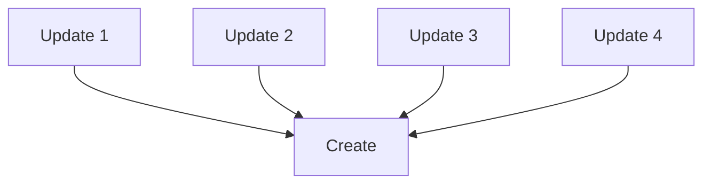
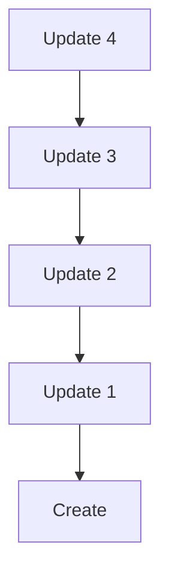

An **entry** is structured data written as a blob to an agent's source chain via a **new-entry action**, which can either be a `Create` or `Update` action. It can be updated or deleted. Although entry data exists as its own entity on a DHT, its associated new-entry action is semantically considered part of it and is stored along with it. This allows separate writes of the same entry data to be distinguished from each other.

## Define an entry type

An entry type can be any Rust struct or enum that `serde` can serialize and deserialize. To define an `EntryType`, use the [`hdk_entry_helper`](https://docs.rs/hdi/latest/hdi/attr.hdk_entry_helper.html) macro:

```rust
use hdi::prelude::*;

#[hdk_entry_helper]
pub struct Movie {
  title: String,
  director: String,
  imdb_id: Option<String>,
  release_date: Timestamp,
  box_office_revenue: u128,
}
```

This implements a host of [`TryFrom` conversions](https://docs.rs/hdi/latest/src/hdi/entry.rs.html#120-209) conversions that your struct or enum is expected to implement.

In order to dispatch validation to the proper integrity zome, Holochain needs to know about your integrity zome's entry types. This is done by implementing a callback in your zome called `entry_defs`, but you can use the [`hdi::prelude::hdk_entry_defs`](https://docs.rs/hdi/latest/hdi/prelude/attr.hdk_entry_defs.html) macro to do this easily:

```rust
use hdi::prelude::*;

#[hdk_entry_defs]
enum EntryTypes {
  Movie(Movie),
  // other types...
}
```

An entry type can be configured as **private**, in which case it is never published to the DHT, but exists only on the author's source chain.

To configure an entry type as private, use the [hdi::prelude::entry_def](https://docs.rs/hdi/latest/hdi/prelude/entry_def/index.html) on the enum variant that defines your entry type, passing the `visibility = "private"` argument to it:

```rust
use hdi::prelude::*;

#[hdk_entry_defs]
enum EntryTypes {
  Movie(Movie),

  #[entry_def(visibility = "private", )]
  HomeMovie(Movie)
}
```

An entry type can be configured to expect a certain number of **required validations**, which is the number of [validation receipts]() that an author tries to collect from authorities before they consider an entry published on the DHT. To configure this, use the [`hdi::prelude::entry_def`](https://docs.rs/hdi/latest/hdi/prelude/entry_def/index.html) macro, this time with the `required_validations` argument:

```rust
use hdi::prelude::*;

#[hdk_entry_types]
enum EntryTypes {
  Movie(Movie),

  #[entry_def(required_validations = 7, )]
  HomeMovie(Movie)
}
```

## Create an entry

Create an entry by calling [`hdk::prelude::create_entry`](https://docs.rs/hdk/latest/hdk/entry/fn.create_entry.html). The entry will be serialized into a blob automatically, thanks to the `hdk_entry_helper` macro.

```rust
use hdk::prelude::*;
use chrono::Date;
use movie_integrity::*;

let movie = Movie {
  title: "The Good, the Bad, and the Ugly",
  director: "Sergio Leone"
  imdb_id: Some("tt0060196"),
  release_date: Timestamp::from(Date::Utc("1966-12-23")),
  box_office_revenue: 389_000_000,
};

let create_action_hash: ActionHash = create_entry(
    &EntryTypes::Movie(movie.clone()),
)?;
```

### Create under the hood

When the client calls a zome function that calls `create_entry`, Holochain does the following:

1. Prepare a **scratch space** for making an atomic set of changes to the source chain for the agent's cell.
2. Write a `Create` action to the scratch space.
3. Return the `ActionHash` of the `Create` action to the calling zome function. (At this point, the action hasn't been persisted to the source chain.)
4. Wait for the zome function to complete.
5. Convert the action to DHT operations.
6. Run the validation callback for all DHT operations.
    * If successful, continue.
    * If unsuccessful, return the validation error to the client instead of the zome function's return value.
7. Publish the actions in the scratch space to the source chain.
8. Return the zome function's return value to the client.
9. In the background, publish all newly created DHT operations to their respective authority agents.

<!-- TODO review and outline steps that are taken under the hood *exactly*, including which DHT ops are published -->

## Update an Entry

Update a new-entry action (either a `Create` or an `Update`) by calling [`hdk::entry::update_entry`](https://docs.rs/hdk/latest/hdk/entry/fn.update_entry.html):

```rust
use hdk::prelude::*;
use chrono::Date;
use movie_integrity::*;

let movie2 = Movie {
  title: "The Good, the Bad, and the Ugly",
  director: "Sergio Leone"
  imdb_id: Some("tt0060196"),
  release_date: Timestamp::from(Date::Utc("1966-12-23")),
  box_office_revenue: 400_000_000,
};

let update_action_hash: ActionHash = update_entry(
    create_action_hash,
    &EntryTypes::Movie(movie2.clone()),
)?;
```

An `Update` operates on a new-entry action (either a `Create` or an `Update`). It doesn't remove the original data; instead, it creates a pointer on the DHT from it to the update and its entry data.

### Update under the hood

Calling `update_entry` does the following:

1. Prepare a **scratch space** for making an atomic set of changes to the source chain for the agent's cell.
2. Write an `Update` action to the scratch space.
3. Return the `ActionHash` of the `Update` action to the calling zome function. (At this point, the action hasn't been persisted to the source chain.)
4. Wait for the zome function to complete.
5. Convert the action to DHT operations.
6. Run the validation callback for all DHT operations.
    * If successful, continue.
    * If unsuccessful, return the validation error to the client instead of the zome function's return value.
7. Publish the actions in the scratch space to the source chain.
8. Return the zome function's return value to the client.
9. In the background, publish all newly created DHT operations to their respective authority agents.

<!-- TODO review and outline steps that are taken under the hood *exactly*, including which DHT ops are published -->

### Update patterns

Holochain gives you this `update_entry` function, but is somewhat unopinionated about how it is used. You can structure your updates as a "list", where all updates refer to the `ActionHash` of the original `Create` action.



Or you can structure your updates as a "chain", where each update refers to the `ActionHash` of the previous new-entry action (either an `Update` or the original `Create`).



If you structure your updates as a chain, you may want to also create links from the `ActionHash` of the original `Create` to each update in the chain, for easier querying. This effectively trades additional storage space for reduced lookup time.

### Choose the latest update

If only the original author is permitted to update the entry, choosing the latest update is simple. Just choose the `Update` action with the most recent timestamp. But if multiple agents are permitted to update an entry, it gets more complicated. Two agents could make an update at exactly the same time (or their action timestamps might be wrong or falsified). So, how do you decide which is the "latest" update?

These are three common patterns:

* Use an opinionated, deterministic definition of "latest" that can be calculated from the content of the update.
* Expose _all_ conflicting updates to the user, and either
    * let them decide which are meaningful, or
    * model your updates with a data structure that can automatically merge simultaneous updates, such as a [conflict-free replicated data type (CRDT)](https://crdt.tech/), then merge all the updates in your coordinator zome or front end.

## Delete an entry

Delete a new-entry action by calling [`hdk::entry::delete_entry`](https://docs.rs/hdk/latest/hdk/entry/fn.delete_entry.html).

```rust
use hdk::prelude::*;

let delete_action_hash: ActionHash = delete_entry(
    create_action_hash,
)?;
```

As with an update, this does _not_ actually remove data from the source chain or the DHT. Instead, a `Delete` action is committed to the cell's source chain, and the new-entry action is marked "dead". An entry itself is only considered dead when all new-entry actions that created it are marked dead, and it can become live again in the future if a _new_ new-entry action writes it. Any dead data can still be retrieved with [`hdk::entry::get_details`](https://docs.rs/hdk/latest/hdk/entry/fn.get_details.html)

In the future we plan to include a "purge" functionality. This will give agents permission to actually erase an entry from their DHT store, but not its associated new-entry action.

Remember that, even once purge is implemented, it is impossible to force another person to delete data once they have seen it. Be deliberate about how data is shared in your app.

### Delete under the hood

Calling `delete_entry` does the following:

1. Prepare a **scratch space** for making an atomic set of changes to the source chain for the agent's cell.
2. Write a `Delete` action to the scratch space.
3. Return the `ActionHash` of the `Delete` action to the calling zome function. (At this point, the action hasn't been persisted to the source chain.)
4. Wait for the zome function to complete.
5. Convert the action to DHT operations.
6. Run the validation callback for all DHT operations.
    * If successful, continue.
    * If unsuccessful, return the validation error to the client instead of the zome function's return value.
7. Publish the actions in the scratch space to the source chain.
8. Return the zome function's return value to the client.
9. In the background, publish all newly created DHT operations to their respective authority agents.

<!-- TODO review and outline steps that are taken under the hood *exactly*, including which DHT ops are published -->

## Identifiers on the DHT

Coming from centralized software architectures, you might expect an entry to have a unique ID that can be used to reference it elsewhere. Holochain uses the hash of a piece of content as its unique ID. In practice, different kinds of hashes have different meaning and suitability to use as an identifier.

To identify the *contents* of an entry, use the entry's `EntryHash`. Remember that, if two new-entry actions write identical entry contents, the entries will collide in the DHT.

A common pattern to identify an *instance* of an entry (i.e., an entry authored by a specific agent at a specific time) is to use the `ActionHash` of the new-entry action which created the entry. This gives you timestamp and authorship information for free, and can be a persistent way to identify the initial entry at the root of a tree of updates.

Finally, you can reference an agent themselves via their `AgentPubKey`. This identifier is similar to `EntryHash` and `ActionHash` in that it's an identifier that you can use to reference agents in the same way you can reference entries and actions.

You can use any of these identifiers as a field in your entry types to model a many-to-one relationship, or you can use links between identifiers to model a one-to-many relationship.

## Retrieving an entry

Get a new-entry action along with its entry data by calling [`hdk::entry::get`](https://docs.rs/hdk/latest/hdk/entry/fn.get.html)] with the action hash.

```rust
use hdk::prelude::*;
use movie_integrity::*;

let maybe_record: Record = get(
    action_hash,
    GetOptions::latest()
)?;
match maybe_record {
  Some(record) => {
    let action = record.action();
    // Not all records contain entry data.
    // A new-entry action, if it exists, will always contain entry data.
    match action.entry_type() {
      Some(App(Movie::)) = {

      },
      Some(App(_)) => debug!("Record {} didn't contain the right entry type", action_hash),
      Some(_) => debug!("Record {} contained a system entry", action_hash),
      _ => debug!("Record {} was not a new-entry action", action_hash)
    }
    let
    let movie: Movie = record.entry().into_option()?.into();
    debug!("Movie {}, released {}, record stored by {} on {}", movie.title, movie.release_date, action.)
  },
  _ => debug!("Record {} not found", action_hash)
}
```

## Community CRUD libraries

If the scaffolder doesn't support your desired functionality, or is too low-level, there are some community-maintained libraries that offer opinionated and high-level ways to work with entries. Some of them also offer permissions management.

- [rust-hc-crud-caps](https://github.com/spartan-holochain-counsel/rust-hc-crud-caps)
- [hdk_crud](https://github.com/lightningrodlabs/hdk_crud)
- [hc-cooperative-content](https://github.com/mjbrisebois/hc-cooperative-content)

## Reference
- [hdi::prelude::hdk_entry_helper](https://docs.rs/hdi/latest/hdi/attr.hdk_entry_helper.html)
- [hdi::prelude::hdk_entry_defs](https://docs.rs/hdi/latest/hdi/prelude/attr.hdk_entry_defs.html)
- [hdi::prelude::entry_def](https://docs.rs/hdi/latest/hdi/prelude/entry_def/index.html)
- [hdk::prelude::create_entry](https://docs.rs/hdk/latest/hdk/entry/fn.create_entry.html)
- [hdk::prelude::update_entry](https://docs.rs/hdk/latest/hdk/entry/fn.update_entry.html)
- [hdi::prelude::delete_entry](https://docs.rs/hdk/latest/hdk/entry/fn.delete_entry.html)
