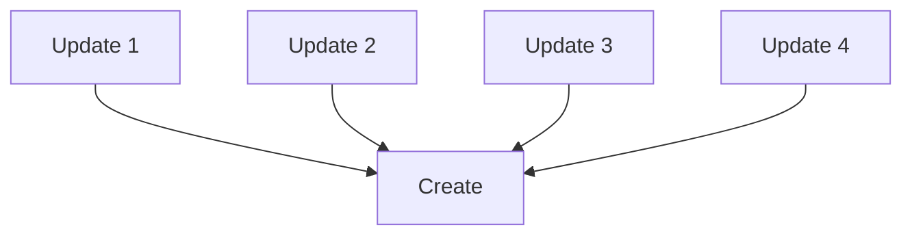
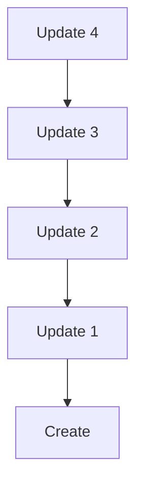

An **entry** is structured data written as a blob to an agent's source chain via a `Create` or `Update` action.

## Define an entry type

An entry type can be any Rust struct or enum that `serde` can serialize and deserialize. To define an `EntryType`, use the [`hdk_entry_helper`](https://docs.rs/hdi/latest/hdi/attr.hdk_entry_helper.html){target=_blank} macro:

```rust
use hdi::prelude::*;

#[hdk_entry_helper]
pub struct Movie {
  title: String,
  director: String,
  imdb_id: Option<String>,
  release_date: Timestamp,
  box_office_revenue: u128,
}
```

This implements a host of [`TryFrom` conversions](https://docs.rs/hdi/latest/src/hdi/entry.rs.html#120-209) conversions that your struct or enum is expected to implement.

In order to dispatch validation to the proper integrity zome, Holochain needs to know about your integrity zome's entry types. This is done by implementing a callback in your zome called `entry_defs`, but you can use the [`hdi::prelude::hdk_entry_defs`](https://docs.rs/hdi/latest/hdi/prelude/attr.hdk_entry_defs.html){target=_blank} macro to do this easily:

```rust
use hdi::prelude::*;

#[hdk_entry_defs]
enum EntryTypes {
  Movie(Movie),
  // other types...
}
```

An entry type can be configured as **private**, in which case it is never published to the DHT, but exists only on the author's source chain.

To configure an entry type as private, use the [hdi::prelude::entry_def](https://docs.rs/hdi/latest/hdi/prelude/entry_def/index.html){target=_blank} on the enum variant that defines your entry type, passing the `visibility = "private"` argument to it:

```rust
use hdi::prelude::*;

#[hdk_entry_defs]
enum EntryTypes {
  Movie(Movie),

  #[entry_def(visibility = "private", )]
  HomeMovie(Movie)
}
```

An entry type can be configured to expect a certain number of **required validations**, which is the number of [validation receipts]() that an author tries to collect from authorities before they consider an entry published on the DHT. To configure this, use the [`hdi::prelude::entry_def`](https://docs.rs/hdi/latest/hdi/prelude/entry_def/index.html){target=_blank} macro, this time with the `required_validations` argument:

```rust
use hdi::prelude::*;

#[hdk_entry_types]
enum EntryTypes {
  Movie(Movie),

  #[entry_def(required_validations = 7, )]
  HomeMovie(Movie)
}
```

## Create an entry

Create an entry by calling [`hdk::prelude::create_entry`](https://docs.rs/hdk/latest/hdk/entry/fn.create_entry.html){target=_blank}. The entry will be serialized into a blob automatically, thanks to the `hdk_entry_helper` macro.

```rust
use hdk::prelude::*;
use chrono::Date;
use movie_integrity::*;


let movie = Movie {
  title: "The Good, the Bad, and the Ugly",
  director: "Sergio Leone"
  imdb_id: Some("tt0060196"),
  release_date: Timestamp::from(Date::Utc("1966-12-23")),
  box_office_revenue: 389_000_000,
};

let create_action_hash: ActionHash = create_entry(
    &EntryTypes::Movie(movie.clone()),
)?;
```

### Create under the hood

When the client calls a zome function that calls `create_entry`, Holochain does the following:

1. Prepare a **scratch space** for making an atomic set of changes to the source chain for the agent's cell.
2. Write a `Create` action to the scratch space.
3. Return the `ActionHash` of the `Create` action to the calling zome function. (At this point, the action hasn't been persisted to the source chain.)
4. Wait for the zome function to complete.
5. Convert the action to DHT operations.
6. Run the validation callback for all DHT operations.
    * If successful, continue.
    * If unsuccessful, return the validation error to the client instead of the zome function's return value.
7. Publish the actions in the scratch space to the source chain.
8. Return the zome function's return value to the client.
9. In the background, publish all newly created DHT operations to their respective authority agents.

<!-- TODO review and outline steps that are taken under the hood *exactly*, including which DHT ops are published -->


## Update an Entry

Update an entry by calling [`hdk::entry::update_entry`](https://docs.rs/hdk/latest/hdk/entry/fn.update_entry.html){target=_blank}:

```rust
use hdk::prelude::*;

let movie2 = Movie {
  title: "The Good, the Bad, and the Ugly",
  director: "Sergio Leone"
  imdb_id: Some("tt0060196"),
  release_date: Timestamp::from(Date::Utc("1966-12-23")),
  box_office_revenue: 400_000_000,
};

let update_action_hash: ActionHash = update_entry(
    create_action_hash,
    &EntryTypes::Movie(movie2.clone()),
)?;
```

### Update Under-the-hood
Calling `update_Entry` does the following:
1. Prepares a "draft commit" for making an atomic set of changes to the source chain for this Cell.
2. Writes a `Update` action in the draft commit
3. Runs the validation callback for all Ops in the draft commit. If successful, continues.
4. Publishes the "draft commit" to the source chain for this Cell
5. Publishes all DhtOps included in the source chain commit to their authority agents
6. Returns the `ActionHash` of the Update action

<!-- TODO review and outline steps that are taken under the hood *exactly*, including which DHT ops are published -->


### Update Patterns

Holochain gives you this `update_entry` function, but is somewhat unopinionated about how it is used.

You can structure your updates as "list" -- where all updates refer to the ActionHash of the original Create action.



Or you can structure your updates as  "chain" -- where each update refers to the ActionHash of the previous update.



If you structure your updates as a "chain" you may want to also create links from the original ActionHash to each update in the chain, for easier querying. This effectively trades additional storage space for reduced lookup time.


### Choose the Latest Update

If only the original author is permitted to update the entry, choosing the latest update is simple. Just choose the Update action with the most recent timestamp.

But if multiple agents are permitted to update an entry it gets more complicated. Two agents could make an update at exactly the same time (or their action timestamps might be wrong or falsified). So, how do you decide which is the "latest" update?

These are two common patterns:
- Use an opinionated deterministic definition of "latest"
- Expose *all* conflicting updates to the user, and let them decide which are meaningful

## Delete an Entry

Delete an entry by calling [`hdk::entry::delete_entry`](https://docs.rs/hdk/latest/hdk/entry/fn.delete_entry.html){target=_blank}.

```rust
use hdk::prelude::*;

let delete_action_hash: ActionHash = delete_entry(
    create_action_hash,
)?;
```

This does *not* actually erase data from the source chain or the DHT. Instead a Delete action is committed to the Cell's Source Chain.

In the future we plan to include a "purge" functionality. This will give Agents permission to actually erase an Entry from the Source Chain and DHT, but not its associated Action.

Remember it is physically impossible to force another person to delete data once they have seen it. Be deliberate about how data is shared in your app.

### Delete Under-the-hood
Calling `delete_entry` does the following:
1. Prepares a "draft commit" for making an atomic set of changes to the source chain for this Cell.
2. Writes a `Delete` action in the draft commit
3. Runs the validation callback for all Ops in the draft commit. If successful, continues.
4. Publishes the "draft commit" to the source chain for this Cell
5. Publishes all DhtOps included in the source chain commit to their authority agents
6. Returns the `ActionHash` of the Delete action

<!-- TODO review and outline steps that are taken under the hood *exactly*, including which DHT ops are published -->

## Entry IDs

Coming from centralized software architectures, you might be expecting an Entry to have a unique ID that can be used to reference it elsewhere.

Instead, Holochain uses hashes to reference content. In practice, different kinds of hashes have different meaning and suitability to use as an identifier.

To identify the *contents* of an Entry, use the entry's `EntryHash`. Remember that identical entry contents will collide in the DHT.

A common pattern to identify an *instance* of an Entry (i.e. an Entry authored by a specific agent at a specific time) is to use the `ActionHash` of the Create action which created the original entry. This can be a persistent way to identify the entry, even when it is updated, as other agents can query for updates themselves to discover the latest version.

## Community CRUD Libraries

If the scaffolder doesn't support your desired functionality, or is too low-level, there are some community-maintained libraries that offer an opinionated and high-level ways to work with entries.

- [rust-hc-crud-caps](https://github.com/spartan-holochain-counsel/rust-hc-crud-caps){target=_blank}
- [hdk_crud](https://github.com/lightningrodlabs/hdk_crud){target=_blank}
- [hc-cooperative-content](https://github.com/mjbrisebois/hc-cooperative-content){target=_blank}


## Reference
- [hdi::prelude::hdk_entry_helper](https://docs.rs/hdi/latest/hdi/attr.hdk_entry_helper.html){target=_blank}
- [hdi::prelude::hdk_entry_defs](https://docs.rs/hdi/latest/hdi/prelude/attr.hdk_entry_defs.html){target=_blank}
- [hdi::prelude::entry_def](https://docs.rs/hdi/latest/hdi/prelude/entry_def/index.html){target=_blank}
- [hdk::prelude::create_entry](https://docs.rs/hdk/latest/hdk/entry/fn.create_entry.html){target=_blank}
- [hdk::prelude::update_entry](https://docs.rs/hdk/latest/hdk/entry/fn.update_entry.html){target=_blank}
- [hdi::prelude::delete_entry](https://docs.rs/hdk/latest/hdk/entry/fn.delete_entry.html){target=_blank}
