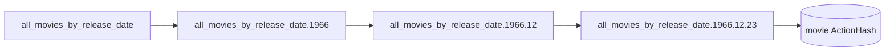

Holochain provides a DHT for storing data, but in order to retrieve data from a DHT you must know the hash of that data first. Links allow you to make data discoverable without knowing its hash. With Links, the DHT forms a a distributed graph database.

## Define a Link Type

Link Types are defined in an Integrity Zome with the macro [hdk_link_types]():

```rust
use hdi::prelude::*;

#[hdk_link_types]
pub enum LinkTypes {
  AgentToLikedMovie,
  AgentToDislikedMovie,
  ReleaseDateIndex,
  ReleaseDateIndexToMovie
}
```

## Elements of a Link

Every Link contains the following application-defined data:

- base: `AnyLinkableHash` that the link can be queried from
- target: `AnyLinkableHash` that the link points to
- tag: Arbitrary bytes stored with the link (optional)
- type: The LinkType of the link

### Linkable Hash Types

A Link can use any linkable hash as its base or target. Allowed linkable hash types are defined in [AnyLinkableHash](). The allowed types are:

- ActionHash
- EntryHash
- AgentPubKey
- ExternalHash: Use for any arbitrary hash that is not native to Holochain.

<!-- TODO more hash types? --> 

## Create a Link

Create a Link by calling [hdk::link::create_link]()

```rust
use hdk::prelude::*;

let movie = Movie {
  title: "The Good, the Bad, and the Ugly",
  director: "Sergio Leone"
  imdb_id: Some("tt0060196"),
  release_date: Timestamp::from(Date::Utc("1966-12-23")),
  box_office_revenue: 400_000_000,
};
let create_action_hash: ActionHash = create_entry(
    &EntryTypes::Movie(movie.clone()),
)?;

let create_link_action_hash: ActionHash = create_link(
  agent_info()?.agent_initial_pubkey,
  create_action_hash,
  LinkType::AgentToLikedMovie,
  (),
)
```

### Create Link Under-the-hood

Links are written to the source chain as a CreateLink Action with no associated Entry. This improves efficiency of storing and querying links. 

Calling `create_link` does the following:
1. Prepares a “draft commit” for making an atomic set of changes to the source chain for this Cell.
2. Writes a CreateLink action in the draft commit
3. Runs the validation callback for all Ops in the draft commit. If successful, continues.
4. Publishes the “draft commit” to the source chain for this Cell
5. Publishes all DhtOps included in the source chain commit to their authority agents responsible for serving the Link's base hash
7. Returns the ActionHash of the CreateLink action

## Delete a Link

Delete a Link by calling [hdk::link::delete_link]()

```rust
use hdk::prelude::*;

let delete_link_action_hash: ActionHash = delete_link(
  create_link_action_hash
)?;
```

This does not actually erase data from the source chain or the DHT. Instead a Delete action is committed to the Cell’s Source Chain.

Remember it is physically impossible to force another person to delete data once they have seen it. Be deliberate about how data is shared in your app.

### Delete Link Under-the-hood

Calling delete_link does the following:

1. Prepares a “draft commit” for making an atomic set of changes to the source chain for this Cell.
2. Writes a DeleteLink action in the draft commit
3. Runs the validation callback for all Ops in the draft commit. If successful, continues.
4. Publishes the “draft commit” to the source chain for this Cell
5. Publishes all DhtOps included in the source chain commit to their authority agents
6. Returns the ActionHash of the DeleteLink action

## Get Links

To retrieve all the Links off a base hash, call [hdk::prelude::get_links]():

```rust
let liked_movie_links: Vec<Link> = get_links(
  agent_info()?.agent_initial_pubkey,
  LinkTypes::AgentToLikedMovie,
  ()
)?;
```

*This excludes Links that have an associated DeleteLink action.*

**Note that you may get different results from subsequent calls.**

<!-- TODO explain why subsequent calls may give different results**

### Get Links Under-the-hood

Calling `get_links` does the following:

<!-- TODO outline holochain_cascade behavior -->


## Count Links

To efficiently retrieve only the number of Links off a given base hash, call [hdk::prelude::count_links]()

```rust
let liked_movies_count: u128 = count_links(
  agent_info()?.agent_initial_pubkey,
  LinkTypes::AgentToLikedMovie,
  None
)?;
```

*This excludes counting Links that have an associated DeleteLink action.*

<!-- TODO fix count_links call -->

**Note that you may get different results from subsequent calls.**

<!-- TODO explain why subsequent calls may give different results**

### Count Links Under-the-hood

<!-- TODO outline holochain_cascade behavior -->

## Get Links with Details

To get all Links from a base hash, including those with associated DeleteLink Actions, call [hdk::prelude::get_link_details]();

```rust
use hdk::prelude::*;

let liked_movie_links: LinkDetails = get_link_details(
  agent_info()?.agent_initial_pubkey,
  LinkTypes::AgentToLikedMovie,
  None
)?;
```

The [LinkDetails]() struct includes all returned links, along with all DeleteLink actions associated with each.

### Get Links with Details Under-the-hood

## Anchor Pattern

A common pattern to make Actions and Entries discoverable is to link to them from a known hash. 

An Anchor is a hash that the application already knows in advance, because it is hardcoded into the compiled Coordinator Zome itself. 

One simple way to construct an Anchor is to use the `Path` trait.

```rust
use hdk::prelude::*

let all_movies_anchor = Path::from("all_movies").path_entry_hash()?;
let links = get_links(all_movies_anchor, (), None)?;
```

## Path Pattern

It is strongly discouraged to create *unbounded* sets of links from a single base hash, as this can become an unequal burden on the agent's who serve those links, and can require large data transfers to respond to a single `get_links` call. This uneven distribution of data on the DHT is called "DHT Hotspotting." To avoid DHT Hotspots we can use the Path pattern to constrain the number of links off a single base, and spread the workload to store and serve them more evenly around the the DHT. However, you must think carefully about how your data will be queried and filtered, to construct Paths that are useful for your application.

Thus, the Anchor pattern is not suitable for many applications.

The Path pattern extends the Anchor pattern, while avoiding unbounded sets of links from a single base hash. It is a series of links, where one Link's base hash is the previous Link's target hash.

By using the Path pattern we can construct deeply nested indexes to make data easily discoverable and filterable by multiple properties.

The HDK provides a Path helper trait, which offers an opinionated set of functions for constructing Paths.

Construct a Path by calling `hdk::prelude::Path::from`:
```rust
let release_date = Date::Utc("1966-12-23");
let movie = Movie {
  title: "The Good, the Bad, and the Ugly",
  director: "Sergio Leone"
  imdb_id: Some("tt0060196"),
  release_date: Timestamp::from(release_date),
  box_office_revenue: 389_000_000,
};
let create_action_hash = create_entry(Movie(movie))?;

// Define the Path
let release_date_path = Path::from(format!("all_movies_by_release_date.{}.{}.{}", release_date.year, release_date.month, release_date.day));

// Call create_link for all Links in the Path
let typed_release_date_path = release_date_path.typed(LinkTypes::ReleaseDateIndex)?;
typed_release_date_path.ensure()?;

// Create a Link from the leaf of the Path to your Action or Entry to index it
let link_create_action_hash = create_link(release_date_path.path_entry_hash()?, create_action_hash, LinkTypes::ReleaseDateIndexToMovie, vec![release_date.year, release_date.month, release_date.day])?;
```

A Path can also be constructed by merging `hdk::prelude::Component`:
```rust
let release_date_path = Path::new(vec![
  Component::from("all_movies_by_release_date"),
  Component::from(release_date.year),
  Component::from(release_date.month),
  Component::from(release_date.day),
]);
release_date_path.ensure()?;

let link_create_action_hash = create_link(release_date_path.path_entry_hash()?, create_action_hash, LinkTypes::ReleaseDateIndexToMovie, None)?;
```

### Path Structure
Each Link's LinkTag contains a String signifying the Path to itself:



## Advanced Patterns

### Link Tag Filtering

A Link includes a LinkTag which can hold any arbitrary bytes, up to 1KB.

Link queries can be further filtered to match their LinkTag bytes, or a prefix of their LinkTag bytes.

This is supported by `get_links`, `get_link_details` and `count_links` calls.

To filter a `get_links` call by LinkTag prefix:

```rust
let release_year: u8 = 1966;
let liked_movies_in_1966: Vec<Link> = get_links(
  agent_info()?.agent_initial_pubkey,
  LinkTypes::AgentToLikedMovie,
  LinkTag::from(vec![release_year])
)?;
```

## Community Link Libraries

- prefix_index
- time_index
<!-- TODO link to libraries, look for others -->

## Reference
- [hdk::prelude::hdk_link_types]()
- [AnyLinkableHash]
- [hdk::prelude::create_link]()
- [hdk::prelude::delete_link]()
- [hdk::prelude::get_links]()
- [hdk::prelude::get_links_count]()
- [hdk::prelude::Path]()
- [hdk::prelude::Component]()
<!-- TODO more path functions -->