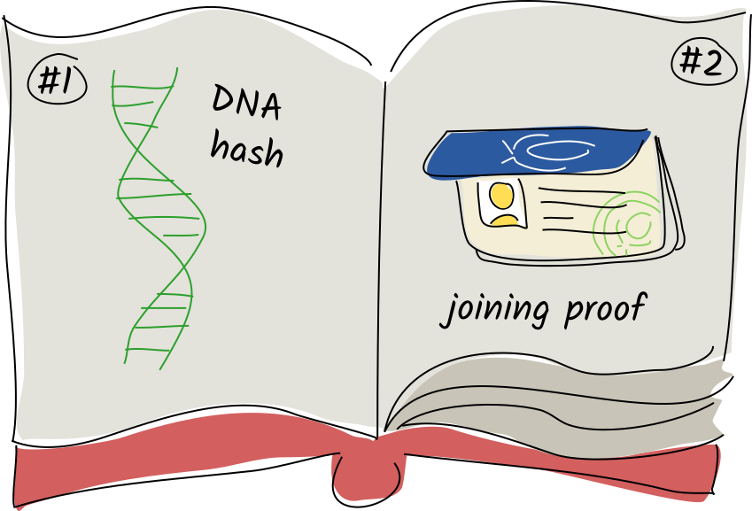
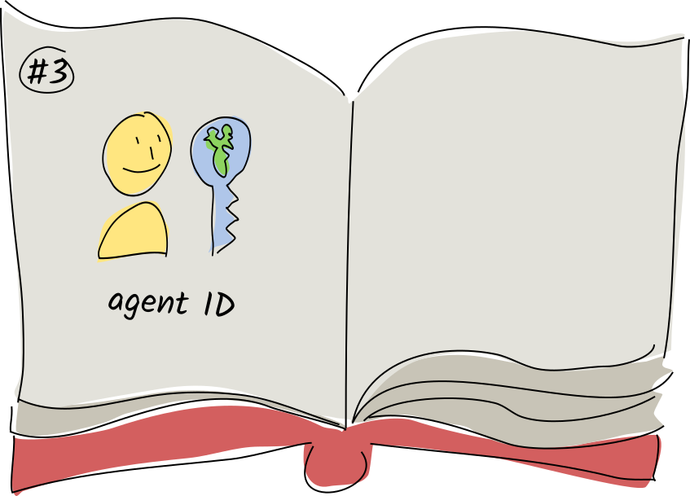
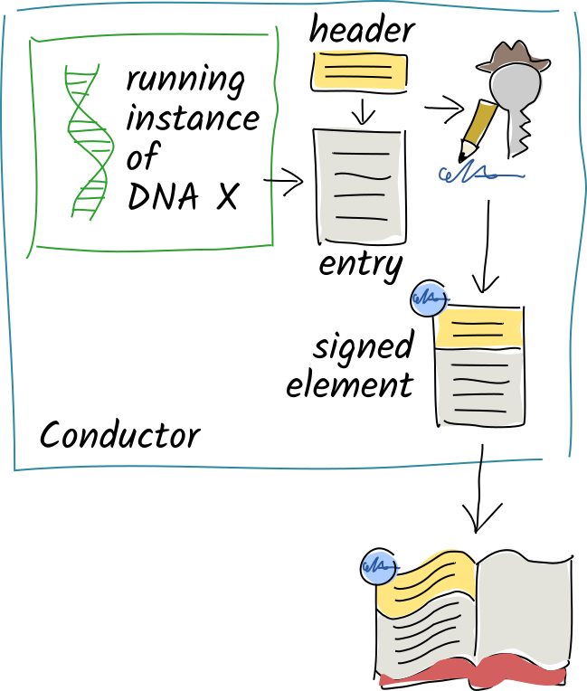

::: coreconcepts-intro
Each user in a Holochain network creates and stores their own data in a journal called a **source chain**. Each journal entry is cryptographically signed by its author and is immutable once written.
:::

::: coreconcepts-orientation
### <i class="fas fa-thunderstorm"></i> What you'll learn

1. [How agent identities are created](#agent-identity)
2. [Where user data is stored](#source-chain-your-own-data-store)
3. [Detecting third-party tampering](#detecting-third-party-tampering)

### <i class="far fa-atom"></i> Why it matters

When you understand how agents and their data are represented, you have the foundational knowledge for creating an appropriate user experience that takes advantage of Holochain’s agent-centric design.
:::

## Agent identity

Let’s take a look at one single node and see what’s happening from the user’s perspective.

Back in [the basics](..//1_the_basics/), we said that one of Holochain's pillars is 'intrinsic data integrity.' The first stone in this pillar is [**public key cryptography**](https://en.wikipedia.org/wiki/Public-key_cryptography), which allows each user to create and authenticate their own identifier without a central password database. If you've ever used [SSH](https://en.wikipedia.org/wiki/Secure_Shell), you're already familiar with this.

When you join a hApp's network, you create an identifier for yourself by generating a **public/private key pair**. This key pair does a few things for you:

* It gives you a unique ID in the app’s network, which shows that you belong and lets others contact you directly.
* It allows you to prove that you authored the things you said you authored.
* It allows others to detect third-party tampering with your data.
* It allows others to encrypt and send you data that only you can decrypt.

All your key pairs are stored in an encrypted, password-protected key manager on your device. This table shows how the public and private keys are used.

|                                                                      Private Key                                                                      |                                        Public Key                                       |
|-------------------------------------------------------------------------------------------------------------------------------------------------------|-----------------------------------------------------------------------------------------|
| • Stays **secret** on your device                                                                                                                     | • **Shared** with all your peers on the network                                         |
| • Acts like a **password**---only you have it, and it's necessary for proving ownership of your public key                                            | • Acts like a **user ID**---uniquely identifies you to other users                      |
| • Acts like a **royal seal**---creates unforgeable, tamper-evident [digital signatures](https://en.wikipedia.org/wiki/Digital_signature) on your data | • Allows others to **verify the integrity** of your signatures                          |
| • Acts like a **mailbox key**---opens messages sealed with your public key                                                                            | • Acts like a **mail slot**---allows others to encrypt and send you data that only you can unlock |
|                                                                                                                                                       |                                                                                         |

## Source chain: your own data store

The next stone in the pillar is a chronological journal of every action that the user has performed in their copy of the app—changing their public key, creating, updating, or deleting public or private data, linking data together, and more. Only the user has the authority to write to it; it lives on their device and each entry must be signed by their private key. This journal is called a **source chain** because every piece of data in an app has its source here.

The user’s actions are stored in the source chain as **records**, which consist of an **action** (we’ll get to that later) and usually some sort of binary data (an **entry**). Each entry has a **type** that distinguishes its purpose, similar to an object-oriented class or database table schema. As with a traditional database, you can define entry types for whatever you need to record—things (such as user profiles, messages, or pictures) or actions (such as chess moves, transactions, or votes).

This journal starts with three special system records:

1. **The hash of the DNA**. Because the DNA’s executable code constitutes the ‘rules of the game’ for everyone in the app, this record shows that your Holochain runtime has seen and agrees to abide by those rules.
2. **The agent’s ‘joining proof’**. When an agent tries to join this DNA’s peer-to-peer network, it shares this entry with the existing peers, who check it and determine whether the agent should be allowed to join. Examples: an invite code, an employee ID signed by the HR department, or a proof of paid subscription fees.
3. **The agent ID**. This contains your public key as a record of your digital identity. The signatures on all subsequent entries must match this public key in order to be valid.

After this come the records that record the user’s actions. These include:

* The creation, modification, and deletion of **app entries** (user data)
* The creation or deletion of **links** between data

(Other special system actions show up too, but we’ll get to those later.) As a developer, you define the format and **validation rules** for each type of app entry or link that your DNA deals with. An entry can contain any sort of binary data, but most of the time you’ll want to give it structure using some sort of serialization format. Our SDK gives you the tools to automatically convert from Rust data structures to [MessagePack](https://msgpack.org) and back again.

_A record on your source chain cannot be modified once it’s been committed._ This is important, because your source chain is a record of all the things you’ve done in the app, and your peers may need to check this record in order to validate that you’re playing by the rules.

## Detecting third-party tampering

If the integrity of your data is so important, what might happen if a third party tried to mess with it en route to your true love or business partner? The answer is, _not much_. Let’s take a look at why.

1. When a function in the DNA wants to record a user action, it creates a record containing the details of that action.
2. Then the conductor calls the DNA’s validation function for that record. If it fails validation, it returns an error to the client.
3. If validation is successful, the conductor signs the record with the user’s private key and writes it onto the end of their source chain.

Like a real-life signature, this cryptographic signature proves that it was you who created the record. It’s based on cryptographic math, so it’s verifiable and impossible to forge. It’s also only valid for the contents of that record — if a third party modifies even a single character of the signed data, the signature no longer matches. It’s like a fingerprint for the data, combined with the author’s own royal seal.

This lets us detect [man-in-the-middle attacks](https://en.wikipedia.org/wiki/Man-in-the-middle_attack) on _record_ data, but it still doesn't tell us whether anyone has tampered with the _order of records_ in the source chain.

Let's take a closer look at the action. Along with the signature, it includes the hash of the previous action, a timestamp, and the entry's type.

Let's look even more closely at that first line in the action.

This hash is the unique cryptographic ‘fingerprint’ for the previous record’s data. This is what ensures the integrity of the entire source chain. Each record points back to its previous entry. With a paper journal, it’s obvious when someone’s ripped out a page, glued a new page in, or taped a sheet of paper over an existing page. This chain of hashes is the digital equivalent: if anyone so much as modifies a single character in a record, all subsequent records will be invalidated.

This is great for helping people detect third-party tampering. But unfortunately anyone can modify their own source chain, regenerate the hashes and signatures, and create a perfectly valid, but wrong, alternate history for themselves. For some applications, this wouldn’t matter so much, but it gets quite serious when the source chain holds things like financial transactions or ballots. So how do we tackle this problem?

Holochain's answer is simple---_somebody will notice_. More on that in the next concept!

## Key takeaways

* Holochain apps do not use logins or password databases. Instead, users create their own digital identifiers as cryptographic public/private key pairs. These two keys together prove their possession of their online identity.
* Users share their public keys with other participants in the same app.
* Users prove authorship of their data via impossible-to-forge digital signatures created with their private key. Third-party data tampering is detected by using the author’s public key to verify the signature.
* The user’s source chain is a chronological record of all the data they’ve produced in an app. It lives on their device.
* Data is stored in the source chain as records — actions and entries.
* Every entry has a type.
* The first three entries are called genesis entries, and are special system types that contain the DNA hash, the agent’s joining proof, and their public key.
* Entries are just binary data, and MessagePack is a good way to give them structure.
* The source chain and all of its data is tamper-evident; validators can detect third-party attempts to modify it.

## Learn more

* [dApp Planning: Crypto Basics](https://medium.com/holochain/dapp-planning-crypto-basics-8bd1073cbe19)
* [Learn Cryptography: what are hash functions?](https://learncryptography.com/hash-functions/what-are-hash-functions)
* [Wikipedia: Hash chain](https://en.wikipedia.org/wiki/Hash_chain)
* [Wikipedia: Public key cryptography](https://en.wikipedia.org/wiki/Public-key_cryptography)
* [Wikipedia: Man-in-the-middle attack](https://en.wikipedia.org/wiki/Man-in-the-middle_attack)
