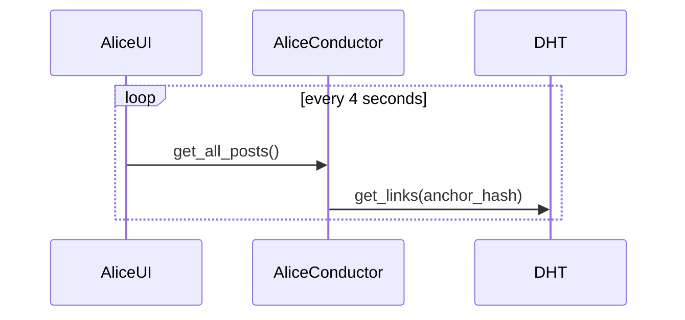
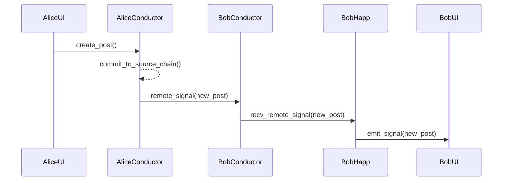
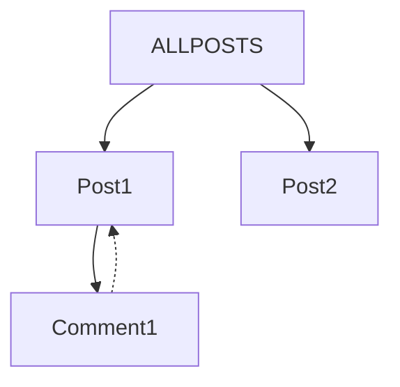

In Quick Start you installed Holochain and built a templated forum application. Here you will use the scaffolding tool to build your own application and learn the basic commands for using the scaffold.

!!! note Pre-requisite
Holochain installed as per [Quick Start](../quick-start/index)
!!!

# Getting Started with Holochain

Welcome to the Getting Started with Holochain guide! This guide provides a detailed walk-through of creating a basic forum application using Holochain. By the end of this guide, you'll be familiar with the core concepts of Holochain and have a basic understanding of how to develop peer-to-peer applications using the Holochain framework.

### Table of contents


1. [Introduction to Holochain](#1-introduction-&-assumptions)
2. [Installing Holochain development environment](#2-installing-holochain-development-environment)  
  2.1. [Hardware requirements](#2-1-hardware-requirements)  
  2.2. [Windows prerequisite: WSL2](#2-2-windows-prerequisite-wsl2)  
  2.3. [Set up development environment](#2-3-set-up-development-environment)  
  2.4. [Verify installation](#2-4-verify-installation)  
3. [Scaffold a Hello World Holochain Application](#3-scaffold-a-simple-hello-world-holochain-application)
4. [Understanding the Layout of a Holochain Application](#4-understanding-the-layout-of-a-holochain-application)
5. [Zero to Built: Creating a Forum App](#5-zero-to-built-creating-a-forum-app)  
  5.1. [Scaffold a Custom Holochain Application](#5-1-scaffolding-a-happ)  
  5.2. [Select User Interface Framework](#5-2-select-user-interface-framework)  
  5.3. [Set up Holonix Development Environment](#5-3-set-up-holonix-development-environment)  
  5.4. [Scaffold a DNA](#5-4-scaffold-a-dna)  
        * [About DNAs](#about-dnas)  
  5.5. [Scaffold a Zome](#5-5-scaffold-a-zome)  
        * [Integrity Zomes & Coordinator Zomes](#integrity-zomes-amp-coordinator-zomes)  
        * [Source Chains](#source-chains)  
  5.6. [Scaffold Entry Types](#5-6-scaffold-entry-types)  
        * [Entry Types](#entry-types)  
        * [CRUD (Create, Read, Update, Delete)]([both#crud-create-read-update-delete)  
        * [Creating a Link when Updating an Entry](#creating-a-link-when-updating-an-entry)  
  5.7. [Scaffold Link Types](#5-7-scaffold-link-types)  
        * [Source Chains, Entries, and Actions]([#source-chains-entries-and-actions](#source-chains-entries-and-actions))  
        * [Bidrectional = Make Two Links](#bidirectional--make-two-links)  
        * [How Links are Stored and Retrieved in a Holochain App](#how-links-are-stored-and-retrieved-in-a-holochain-app)  
  5.8. [Scaffold a Collection](#5-8-scaffold-a-collection)  
  5.9. [Integrate the Generated UI Elements](#5-9-integrate-the-generated-ui-elements)  
        * [Detailed Breakdown of App.svelte](#detailed-breakdown-of-appsvelte)  

TODO (Matt's best guess at this):  
6. Creating Validation Rules  
7. Built to Beautiful: adjusting our User Interface  
8. Creating Tests  
9. Deploying Your Holochain Application  
  9.1. Packaging Your Application  
  9.2. Configuring the Conductor  
  9.3. Running Your Application  
10. Testing Your Holochain Application  
  10.1 Creating Test Scenarios  

#### How to use this guide

Follow this guide step by step. All steps are essential to create the example applications. No additional code or steps are needed.

* The examples below use `$` to represent your terminal prompt in a UNIX-like OS.  Note that on your OS the prompt may have been customized to appear differently.

### 1. Introduction & Assumptions

* We assume that you are reading this guide because your are a developer new to Holochain but interested in actually building peer-to-peer distributed applications using a framework that is agent-centric, that provides intrinsic data integrity, is scalable, and when deployed, end-user code runs just on the devices of the participants without relying on centralized servers or blockchain tokens or other points of centralized control.  
* We assume that you've at least skimmed [Holochain's Core Concepts](https://developer.holochain.org/concepts/1_the_basics/) or are ready to pop over there when needed.  
* Because Holochain's DNA's are written in Rust, we assume you have at least a basic familiarity with the language.  Note however that Holochain DNAs rarely need to take advantage of the more complicated aspects of the language, so don't let Rust's learning curve scare you.
* We also assume that you have basic familiarity with the Unix or Windows command-line.

### 2. Installing Holochain development environment

In this section, we'll walk you through the step-by-step process of installing the Holochain dev environment and its dependencies on your system so that you can develop hApps.

#### 2.1. Hardware requirements

Before you install the Holochain Developer Environtment, make sure your system meets the following hardware requirements:

* 8GB+ RAM (16GB+ recommended)
* 4+ cores CPU (6+ cores recommended)
* 30GB+ available disk space
* High-speed internet connection

#### 2.2. Windows prerequisite: WSL2

For Windows users, please note that the Nix package manager, which is used to install and manage Holochain development tools, only supports macOS and Linux. You will need to [install Linux under Windows with WSL2 (Windows Subsystem for Linux)](https://learn.microsoft.com/en-us/windows/wsl/install) (recommended) or dual boot a Linux Operating System, alongside your [Windows 10](https://www.freecodecamp.org/news/how-to-dual-boot-windows-10-and-ubuntu-linux-dual-booting-tutorial/) or [Windows 11](https://www.xda-developers.com/dual-boot-windows-11-linux/) OS to proceed.

Holochain is supported for the Ubuntu distribution under WSL2.

#### 2.3. Set up development environment

Once you've ensured that your system meets the hardware requirements and set up WSL2 on Windows or a dual boot Linux OS (if applicable), you can proceed with the installation of the Nix package manager and Holochain binary cache.

Open a [command line terminal](https://hackmd.io/c15fobj9QtmOuEuiNAkaQA) and run the following command:

```
bash <(curl https://holochain.github.io/holochain/setup.sh)
```

This command downloads the setup script and runs it, installing the Nix package manager and setting up the Holochain binary cache.

#### 2.4. Verify installation

In a new terminal session type:

```
nix run --refresh -j0 -v github:holochain/holochain#hc-scaffold -- --version
```

Look out for binaries being copied from `holochain-ci.cachix`:

```
downloading 'https://holochain-ci.cachix.org/nar/<some-hash>.nar.zst'...
```

This also proves that the Cachix binary cache is configured correctly.

At the end of the output a scaffolding CLI version should be printed:

```text
holochain_scaffolding_cli x.y.z
```

Congratulations! The Holochain development environment is now set up successfully on your system.

### 3. Scaffold a simple "Hello, World!" Holochain application

In this section, we'll use Holochain's scaffolding tool to generate a simple "Hello, World!" application.

When getting started, seeing a simple, but fully-functional app can be very helpful. You can have Holochain's scaffold tool generate a "Hello, World!" application (but for a distributed multi-agent world), by typing the following in your command line terminal:

```bash
$ nix run github:holochain/holochain#hc-scaffold -- example hello-world
```

The scaffolding app should print out these instructions:

```bash
$ cd hello-world
$ nix develop
$ npm install
$ npm start
```

When you follow them, you should see two windows pop up representing two agents, both of which will have published a `Hello World` entry to the network, and when you click on the "get hellos" button, you should be able to see the hellos:

[image of hellos?]

When you are done checking out the hello world app that has been created. You can go back to the terminal and stop the hApp by pressing ctrl-c (linux) or cmd-c (MacOS)

### 4. Understanding the layout of a Holochain application

To understand the layout of a Holochain application, let's explore the different files and directories that make up the structure of the Hello, World! hApp that you just created.

From our hello-world folder, list the directories and files in that folder by entering:

```bash
$ ls
```

If you are new to navigating directories and files using the command line, check out [Navigating with the Command Line (Mac + Linux)](https://hackmd.io/@oitz5O-qR2qrfRre3Kbv-Q/SJqWJ6T43)

For now, make use of

* `ls` to list the contents of the directory that you are in,
* `cd <directory_name>` to navigate into a particular sub-directory, and
* `cd ..` to navigate back up to a parent directory.

---

<details>
  <summary>

### Scaffolded application structure

  </summary>

This table includes everything in the `hello-world/` directory as well as details of the contents of the `dnas/` sub-directory since that makes up the bulk of the "Holochain" part of an application. The table only contains a high level overview of the node_modules/, target/, tests/, and ui/ folders).

| File/Folder                 | Purpose                                                                                       |
|-----------------------------|-----------------------------------------------------------------------------------------------|
|├──`hello-world/`              | Root directory of the "Hello, World!" application. All other files and folders will reside here. |
|└─┬─`dnas/`                 | This folder contains the DNA configuration and source code for the application. DNAs are one of the most important building blocks in Holochain. Simply put, **a DNA is the source-code for the game you are playing with your peers in Holochain.** And here is the twist: in Holochain, **every DNA creates its own peer-to-peer network** (for the validation, storage, and serving of content).  Every Holochain Application contains at least one DNA. In this example hApp, we have just one: `hello_world`. |
| │├┬─`hello_world/`  | Folder for the "Hello, World!" DNA. This folder contains modules (zomes) that define the rules of this application.  |
| │ ├┬─ workdir | A working directory containing configuration files and compiled artifacts related to the DNA. |
| │ │├── `dna.yaml`      | DNA configuration file. A YAML configuration file that defines the properties and zomes of the DNA. YAML is a human-readable data serialization language. |
| │ │└── `hello_world.dna`      | The compiled DNA file, which includes both the integrity and coordination zomes. This file is used by Holochain to run the hApp. |
| │ ├──`zomes/`        | The executable code modules in a DNA are called zomes (short for chromosomes), each with its own name like profile or chat or in our case `hello` (below). Zomes define the core business logic in a DNA. This folder contains zomes for the `hello_world` DNA. Zome modules can be composed together to create more powerful functionality. DNAs in Holochain are always composed out of one or more zomes. |
| │ ├┬─ `coordinator/`| This folder contains the coordination zomes, which are responsible for this DNA's controller layer, such as committing data and handling communication between peers. |
| │ │└┬─`hello_world/`| Folder containing the `hello_world` coordination zome. |
| │ │ ├┬─ `src/`| Source code folder for the `hello_world` coordination zome. Note: in Rust, lib.rs is the entry point for a rust crate. If you have nothing else in your rust module, you should have a lib.rs file|
| │ │ │└── `lib.rs`| The main source code file for the `hello_world` coordination zome. |
| │ │ └──`Cargo.toml`| The manifest file for the `hello_world` coordination zome, containing metadata, dependencies, and build options. |
| │ └┬─`integrity/`| This folder contains the integrity zomes, which are responsible for the application's model layer, such as defining data structures and validation rules. |
| │  └┬─`hello_world/`| Folder containing the `hello_world` integrity zome. |
| │   ├┬─ `src/`| Source code folder for the `hello_world` integrity zome. |
| │   │└── `lib.rs`| The main source code file for the `hello_world` integrity zome. |
| │   └──`Cargo.toml`| The configuration file for Rust, containing dependencies and build options for the `hello_world` integrity zome. |
| ├──`node_modules`  | A folder containing JavaScript packages and dependencies for the user interface. |
| ├──`target`  | A folder containing the compiled output from the Rust build process. |
| ├──`tests`  | A folder containing test code for the "Hello, World!" application. |
| ├──`ui`  | A folder containing the source code and assets for the user interface of the "Hello, World!" application. |
| ├──`workdir`  | A temporary working directory used by Holochain during the build process. |
| ├──`Cargo.lock` | A file generated by Cargo, Rust's package manager, that lists the exact versions of dependencies used in the project. |
| ├──`Cargo.toml` | The main configuration file for the Rust project, containing dependencies, build options, and other metadata for the "Hello, World!" application. |
| ├──`flake.lock` | A file generated by Nix, a package manager, that lists the exact versions of dependencies used in the project. |
| ├──`flake.nix` | A Nix expression that defines the project's build environment, dependencies, and how the project should be built. |
| ├──`package.json` | The main configuration file for the JavaScript/Node.js project, containing dependencies, scripts, and other metadata for the user interface of the "Hello, World!" application. |
| ├──`package-lock.json` | A file generated by npm, Node.js package manager, that lists the exact versions of dependencies used in the user interface project. |
| └──`README.md` | A markdown file containing the documentation and instructions for the "Hello, World!" application, including how to build, run, and test the project. |

These files and folders make up the structure of a Holochain application, with the main logic being defined in the DNAs (in the `dnas/` folder) and the User Interface being defined in the `ui/` folder. By understanding the layout and purpose of each file and folder, you can effectively develop and maintain your Holochain application.

</details>

---

### 5. Zero to built: creating a forum app

First, navigate back to the directory where you want to keep your Holochain applications. If this is just your home directory, you can navigate there by typing `cd ~`.

!!! warn "Pre-requisite"
First, ensure you have Holochain installed as per section 2.
!!!

Next up, we'll walk you through creating a forum application from scratch using Holochain's scaffolding tool, step-by-step. Our forum application will enable participants to share text based posts and to comment on those posts. 

Each post will have a title and content and authors will be able to edit --- or update --- their posts. However, they won't be able to delete them. 

Each comment will be a reply to a particular post and comments will be limited in length to 140 characters and able to be deleted, but not updated.

We'll create a couple of other things along the way that will enable us to find these posts and comments, but we'll cover those things when we get there.

The good news is that the Holochain scaffold tool will do a lot of the heavy lifting in terms of generating folders, files and writing boiler plate code. It will walk us through each step in the hApp generation process. In fact, the scaffold does so much of the work for us on the backend, that many people have commented that the time spent writing a holochain app is 90% (or more) focused on building out the frontend user interface and experience. 

First, let's use the scaffolding tool to generate the basic folders and files for our hApp.

#### 5.1. Scaffolding a hApp

To start, run the following command in your terminal:

```bash
$ nix run github:/holochain/holochain#hc-scaffold -- web-app
```

You should then see:

```text
? App name (no whitespaces):
```

Enter the name of your forum application using snake_case. Let's enter:

```text
my_forum_app
```

#### 5.2. Select user interface framework

You'll then be prompted to choose a user interface (UI) framework for your front-end.

For this example, use the arrow keys to choose **Svelte** and press **\<enter\>**.

#### 5.3. Set up Holonix development environment

Next, you'll be asked if you want to set up the Holonix development environment for the project.

Choose **Yes (recommended)** and press **\<enter\>**.

You should see:

```text
Setting up nix development environment...
```

along with some details of what is being added. Follow the instructions to set up the development environment for your hApp and continue to scaffold more of its elements.

First, enter the hApp project directory:

```bash
$ cd my_forum_app
```

Just to get an overview of what our first scaffold command set up for us, let's check the contents of that `my_forum_app` folder by typing:

```bash
$ ls
```

It should look like it has set up a similar set of folders and configuration files to those we saw in the "Hello, World!" hApp.

Now, fire up the nix development shell, which makes all scaffolding tools and the Holochain binaries directly available from the command line by entering:

```bash
$ nix develop
```

You should see:

```text
Holochain development shell spawned. Type exit to leave.
```

As it says, if at any time, you want to leave the  nix development shell, you can type `exit`. But for now, let's install the Node Package Manager (npm) dependencies with:

```bash
$ npm install
```

When that finishes, we should see some text that ends with something like:

```text
added 371 packages, and audited 374 packages in 1m

37 packages are looking for funding
    run 'npm fund' for details
found 0 vulnerabilities
```

If you see something like that, you've successfully downloaded the dependencies for building hApps.

Now if we again enter:

```bash
$ ls
```

We should notice that a new folder has been added called `node_modules`. If we opened that folder we would see a whole bunch of programs that have been installed to aid us in building hApps. If you have, before going to the next step, just make sure that you [navigate back](https://hackmd.io/@oitz5O-qR2qrfRre3Kbv-Q/SJqWJ6T43) to the root folder for our hApp: `my_forum_app`.

!!! info "Backing out of a mistake"
A quick note: if while scaffolding some part of your hApp, you realize you've made a mistake (a typo or wrong selection for instance), as long as you haven't finished scaffolding that portion, **you can stop the scaffold by using \<Ctrl-c\> on Linux or \<Command-c\> on macOS**.
!!!

!!! info "Scaffolding subcommands"
To get an overview of the subcommands that hc scaffold makes available to us, let's enter:

```bash
$ hc scaffold --help
```

We should see something like:

```text
holochain_scaffolding_cli 0.1.8
The list of subcommands for `hc scaffold`

USAGE:
    hc-scaffold <SUBCOMMAND>

FLAGS:
    -h, --help       Prints help information
    -V, --version    Prints version information

SUBCOMMANDS:
    collection    Scaffold a collection of entries in an existing zome
    dna           Scaffold a DNA into an existing app
    entry-type    Scaffold an entry type and CRUD functions into an existing zome
    example
    help          Prints this message or the help of the given subcommand(s)
    link-type     Scaffold a link type and its appropriate zome functions into an existing zome
    template      Set up the template used in this project
    web-app       Scaffold a new, empty web app
    zome          Scaffold one or multiple zomes into an existing DNA
```
!!!

We've already scaffolded a new web-app!

Next up, we are going to start creating one of the most important building blocks in a Holochain app: a DNA.

#### 5.4. Scaffold a DNA

A DNA directory is where we will put the content that defines the rules of our application. We are going to stay in the `my_forum_app/` root directory of our hApp and with some simple commands, the scaffold tool will do much of the creation of relevant folders and files for us.

<details>
<summary>

### About DNAs

</summary>

#### Why do we use the term DNA?

In Holochain, we are trying to enable coherent social coordination that people are choosing to participate in. To do that, we are borrowing some patterns from how biological organisms are able to coordinate coherently even at scales that social organisations such as companies or nations have come nowhere close to. In living creatures like humans, dolphins, redwood trees and coral reefs,  many of the cells in the body of an organism (trillions of the cells in a human body for instance) are each running a (roughly) identical copy of a rule set in the form of DNA.

This enables many different independent parts (cells) to build relatively consistent super structures (a body for instance), move resources, identify and eliminate infections and more --- all without centralized command and control. There is no "CEO" cell in the body telling everybody else what to do. Its a bunch of independent actors (cells) playing by a consistent set of rules (the DNA) coordinating in effective and resilient ways.

A cell in the muscle of your bicep finds itself in a particular context, with certain resources and conditions that it is facing. Based on those signals, that cell behaves in particular ways, running relevant portions of the larger shared instruction set (DNA) and transforming resources in ways that fit the context of that part of the larger organism when faced with those circumstances. A different cell in your blood, perhaps facing a context where there is a bacterial infection, will face a different set of circumstances and consequently will make use of other parts of the shared instruction set to guide how it behaves. In other words, many biological organisms make use of this pattern where "many participants run the same rule set, but each in their own context" and that unlocks a powerful capacity for coherent coordination.

Holochain borrows this pattern that we see in biological coordination to try to enable similarly coherent social coordination. However, our focus is on enabling such coherent social coordination to be "opted into" by the participants. We believe that this pattern of being able to choose which games you want to play --- and being able to leave them or adapt them as experience dictates --- is critical to enabling individual and collective adaptive capacity. We believe that it may enable a fundamental shift in the ability of individuals and communities to sense and respond to the situations that they face.

To put it another way: if a group of us can all agree to the rules of a game, then together we can play that game.

All of us opting in to those rules --- and helping to enforce them --- enables us to play that game together whether it is a game of chess, chat, a forum app or something much richer.

#### DNA as boundary of network

A Holochain DNA and the network of participants that are running that DNA enable "peer witnessing" of actions by the participants of that network. A (deterministically random) set of peers are responsible for validating, storing and serving each particular piece of content. In other words, the users of a particular hApp agree to a set of rules and then work together collectively to enforce those rules and to store and serve content (state changes) that do not violate those rules.

#### Our network of peers is determined at the DNA level

Every hApp needs to include at least one DNA. Moreover, as indicated above, **it is at the DNA level** (note: not the higher Application level) **where users will form a network of peers to validate, store and serve content** in accordance with the rules defined in that DNA.

There are some powerful consequences to this architectural choice --- including freedom to have your application look and feel the way you want, or to combine multiple DNA's together in ways that work for you without having to get everyone else to agree to do the same --- but we'll save those empowerment/flexibility details for later.

#### So if we have multiple DNAs in our hApp...

...then we are participating in multiple networks, with each network of peers that are participating in a particular DNA also participating alongside one another in the Distrubuted Hash Table for that DNA, and enforcing those rules while validating, storing and serving content alongside those DNA/DHT peers.

This is similar to the way in which multiple DNA communities coexist in biological organisms. In fact, there are more cells in a human body that contain other DNA (like bacteria and other microorganisms) than cells that contain our DNA. This indicates that we are an _ecology_ of coherent communities that are interacting with --- and evolving alongside --- one another.

When it comes to hApps, this let's us play coherent games with one another at the DNA level, while also participating in adjacent coherent games with others as well. That means that applications are not one size fits all. You can chose to combine different bits of functionality in interesting and even novel ways.

</details>

For now, let's create a new DNA using the scaffolding tool by entering:

```bash
$ hc scaffold dna
```

You should then see:

```text
? DNA name (snake_case):
```

We need to enter a name for the DNA. Let's use:

```text
forum
```

You should then see:

```text
DNA "forum" scaffolded!
Add new zomes to your DNA with:
    hc scaffold zome
```

Success! Inside of our `dnas/` directory, the scaffolding tool generated a `forum/` directory and inside of that, the folders and files that any DNA needs. At this point we have a skeleton structure for our `forum` DNA. As we take the next steps, the scaffolding tool will make additions and edits to some of those directories and files based on our instructions.

Next up, we want to create our first module of functionality for the forum DNA.

#### 5.5. Scaffold a zome

DNAs are comprised of code modules, which we call zomes (short for Chromosomes). Zomes are modules that typically focus on enabling some related functionality. Building with this sort of modular pattern provides a number of advantages, including the ability to reuse a module in more than one DNA to provide similar functionality in a different context. For instance, the [profiles zome](https://github.com/holochain-open-dev/profiles) is one that many apps make use of. For our forum DNA, we'll create one zome: **posts**.

Start by entering:

```bash
$ hc scaffold zome
```

You should then see:

```text
? What do you want to scaffold? ›
❯ Integrity/coordinator zome-pair (recommended)
  Only an integrity zome
  Only a coordinator zome
```

<details>
<summary>click to expand

### Integrity zomes & coordinator zomes

</summary>

#### Integrity zomes

An integrity zome, as the name suggests, is responsible for maintaining the data integrity of a Holochain application. It sets the rules and ensures that any data transactions occurring within the application are consistent with those rules. In other words, it is responsible for ensuring that data is correct, complete, and trustworthy. Integrity zomes help maintain a secure and reliable distributed peer-to-peer network by enforcing the validation rules defined by the application developer, in this case, you!

#### Coordinator zomes

On the other hand, a coordination zome contains the code that actually commits data, retrieves it, sends and receives messages between peers or between portions of that application on a users own device (between the backend and the front end UI, for instance).

#### Why two types?

They are separated from one another so we can update one (especially coordination) without having to update the other (integrity). This is important, because changes made to an integrity zome result in a fork of the application (you would find yourself suddenly in a new and different network than the other folks who haven't yet changed their integrity zome) - and we want to minimize those sorts of forks to situations where they are needed (like when a community decides they want to play by different rules - for instance changing the maximum length of messages from 140 characters to 280 characters. At the same time, it is important that we be able to improve the ways in which communication is done in a Holochain app. We want agents to be able to take advantage of the latest improvements in Holochain - and separating integrity and coordination enables them to do that.

Dive into zomes and more in this article on [Application Architecture](https://developer.holochain.org/concepts/2_application_architecture/).    
</details>

For this app, we are going to want both an Integrity Zome and a Coordinator Zome, so use the arrow keys to select:

```text
Integrity/coordinator zome-pair
```

and press **\<enter\>**.

You should then see:

```text
? Enter coordinator zome name (snake_case):
 (The integrity zome will automatically be named '{name of coordinator zome}_integrity')
```

Enter the name:

```text
posts
```

and press **\<enter\>**.

You should then see prompts asking if you want to scaffold the integrity and coordinator zomes in their respective default folders.

Press `y` for both prompts.

As that runs (which will take a moment as the scaffold makes changes to various files) you should then see:

```text
Coordinator zome "posts" scaffolded!
Updating crates.io index
    Fetch [===>       ] ... (then after download is done...)
Downloaded (a bunch of downloaded files ... then)

Add new entry definitions to your zome with:
    hc scaffold entry-type
```

Once that is all done, our hApp skeleton will have filled out a bit. Before we scaffold the next piece, let's give a little context for how content is "spoken into being" when a participant publishes a post in a forum hApp.

If you aren't yet familiar with Holochain's concept of a source chain, check out [The Source Chain: A Personal Data Journal](https://developer.holochain.org/concepts/3_source_chain/).

<details>
<summary>

### Source chains

</summary>

Any time a participant in a hApp takes some action, they first create and store their own data (their state changes) in a journal called a source chain. Each journal entry in that source chain is cryptographically signed by its author and is immutable (can't be changed) once written.

In Holochain applications, data is always "spoken into being" by an agent (a participant) from their own perspective.

An important part of this is a concept we call "intrinsic data integrity".

In short, they are telling the network something like: I am creating this forum post with the title: "Intros" and the content: "Where are you from and what is something you love about where you live?"

Unlike a centralized application, we aren't just going to add that into some database. We are going to ensure that:

1. the action being taken doesn't violate the validation rules of our application,
2. then we will add it as the next addition to our source chain, and then
3. we will share it with the storage network (DHT) for that DNA.

</details>

Now it is time to start defining the structure and validation rules for data within our application.

#### 5.6. Scaffold entry types

An entry type is a fundamental building block used to define the structure and validation rules for data within a distributed application. Each entry type corresponds to a specific kind of data that can be stored, shared, and validated within the application.

<details>
<summary>

### Entry types

</summary>

An entry type serves the following roles in a zome:

Data Structure: Entry types define the data structure for a particular kind of information within the application. This structure typically includes properties like fields, data types, and relationships between fields. By providing a well-defined structure, entry types ensure that data is consistently formatted and organized across the entire distributed network.

Validation Rules: Entry types are also responsible for specifying the validation rules that govern how the data can be created, updated, or deleted within the application. These rules ensure that data transactions comply with the application's business logic and maintain the overall data integrity. The validation rules defined for an entry type are executed by the integrity zome.

Access Control: Entry types can also define access control rules, determining which agents (users) are allowed to interact with specific data. Access control can be set at the level of creating, reading, updating, or deleting data for a particular entry type. This helps to maintain data privacy and security within the application.

</details>

We will want to create two entry types for our Posts zome: **`post`** and **`comment`**. Posts will have a title and a content field. Comments will have a comment_content field and a way of indicating which post they are a comment on.

Let's go ahead and follow the instructions that the scaffold suggested for adding "new entry definitions to your zome".

Let's create the **`post`** entry type first. Enter:

```bash
$ hc scaffold entry-type
```

You should then see:

```text
✔ Entry type name (snake_case):
```

Enter the name:

```text
post
```

You should then see:

```text
Which fields should the entry contain?

? Choose field type: ›
❯ String
  bool
  u32
  i32
  f32
  Timestamp
  ActionHash
  EntryHash
  DnaHash
  AgentPubKey
  Enum
  Option of...
  Vector of...
```

The scaffold tool is prompting us to add fields to the `post` entry type.

Fields are the individual components or attributes within an entry type that define the structure of the data. They determine the specific pieces of information to be stored in an entry and their respective data types.

For our `post` entry type, we are going to add a **`title`** and a **`content`** field.

Let's first add the title field.

Select `String` as the field type, and enter:

```text
title
```

as the field name.

Choose `y` for the field to be visible in the UI, and use the arrow keys to select `TextField` as the widget to render this field.

A `TextField` is a single-line input field designed for capturing shorter pieces of text.

When you see:

```text
?Add another field to the entry?(y/n)
```

press `y`.

For the **`content`** field, we are also going to select `String` as the field type. Then enter `content` as the field name.

Choose `y` for the field to be visible in the UI, and select `TextArea` as the widget to render the field.

A `TextArea` is a multi-line input field that allows users to enter larger blocks of text. That works for the longer chunks of text that people may want to add as the content (body) of their posts in our forum app.

After adding the title and description fields, press `n` when asked if you want to add another field. Next, you should see:

```text
Which CRUD functions should be scaffolded (SPACE to select/unselect, ENTER to continue)?
✔ Update
✔ Delete
```

The scaffolding tool can add zome and UI functions for updating and deleting entries. In this case, we do not want authors to be able to update or delete posts, so let's use the arrow keys and the spacebar to ensure that neither Update nor Delete have checks. It should look like this:

```text
Which CRUD functions should be scaffolded (SPACE to select/unselect, ENTER to continue)?
  Update
  Delete
```

Then press **\<enter\>**.

<details>
<summary>

### CRUD (create, read, update, delete)

</summary>

CRUD functions grant or deny users the ability to take those actions with regard to a particular entry type.

In Holochain, each agent (participant) has their own log of actions (their source chain), which is a local and tamper-proof record of their actions. When an agent creates a new entry, it is appended to their source chain, making data creation inherently agent-centric.

**By default, the scaffolding tool provides a Create function for entry types** because creating new entries is a fundamental part of any application, and it reflects the core principle of Holochain's agent-centric approach.

Similarly, when a public entry is published, it becomes accessible to other agents in the network. Public entries are meant to be shared and discovered by others, so **a Read function is provided by default** to ensure that agents can easily access and retrieve publicly shared entries. The content of private entries are not shared to the rest of the network. For more info on entries, see: the **Core Concepts sections on [Source Chains](https://developer.holochain.org/concepts/3_source_chain/) and [DHT](https://developer.holochain.org/concepts/4_dht/)**.

While Holochain defaults to providing Create and Read functions for entry types, **developers decide whether to enable Update and Delete functions for a particular entry type based on their specific application requirements**. More details in the Core Concepts section on [CRUD](https://developer.holochain.org/concepts/6_crud_actions/).

</details>

Next, you should see:

```text
Entry type "post" scaffolded!

Add new collections for that entry type with:

    hc scaffold collection
```

We'll dive into links in a moment, but first let's create the **`comment`** entry type.

Again type:

```bash
$ hc scaffold entry-type
```
This time enter the name:

```text
comment
```

for the entry type name.

We're going to add a **`comment_content`** field, so select the `String` field type and enter:

```text
comment_content
```
Select `y` to make this field visible in the UI.

Then select `TextArea` widget and press **\<enter\>**.

Again, a `TextArea` is a multi-line input field that allows users to enter larger blocks of text. Perfect for a comment on a post.

Select `y` to add another field.

For this next field we want to create a field that will help us associate each particular comment to the post that it is commenting on.

We are going to use the arrow keys to select **ActionHash** as the field type and after hitting **\<enter\>**, we should see:

```text
? Should a link from this field be created when this entry is created? (y/n) ›
```

Go ahead and press `n` to decline creating a link. Typically, we would make use of this shortcut. However, we are going to take an opportunity to do a more thorough introduction to links and will instead manually create that link in just a little bit when we walk through using the 'hc scaffold link-type' command.

Next you will see:
```text
✔ Which entry type is this field referring to? 
```
Press **<enter>** to accept the suggested field `Post`

Next, you will be asked to pick a field name.
You can press **<enter>** to accept the Field name suggestion, which should be:

```bash
post_hash
```

press `n` to decline adding another field to the entry.

We do want commentors to be able to update and delete comments, so leave both Update and Delete selected. It should look as follows:

```text
Which CRUD functions should be scaffolded (SPACE to select/unselect, ENTER to continue)?
✔ Update
✔ Delete
```

Once that is done, hit **\<enter\>** to generate Update and Delete functionality for the **`comment`** entry type.    

At this point you should see:

```text
? Should a link from the original entry be created when this entry is updated? ›
❯ Yes (more storage cost but better read performance, recommended)
  No (less storage cost but worse read performance)
```

<details>
<summary>

### Creating a link when updating an entry

</summary>

#### Updating entries

In short, this is about how changes get dealt with when a piece of content is updated.

In Holochain apps, we don't just go changing content. Instead, we use metadata (links) to indicate that this particular piece of content has been replaced by something else.

If we select **yes**, later, when we make a change to an entry of this type, Holochain will mark the original entry as updated and point to the replacing entry using a link. That enables anybody who looks up that content to be able to see the original if they want, but also to easily retrieve the newer, updated version. It requires storage for the link entry in the DHT, but maintains a more organized and accessible data structure, and is recommended for most applications.

If no link between the original and updated entries is created, no storage of that link is required. However, to find updated entries, agents might need to perform more extensive queries or rely on application-specific mechanisms to track updates.

</details>

Go ahead and select `Yes` by pressing **\<enter\>**.    
    
You should then see:

```text
Entry type "comment" scaffolded!

Add new collections for that entry type with:

    hc scaffold collection
```

<details>
<summary>

### Source chains, entries, and actions

</summary>

#### Source chain

In Holochain, each participant in each application has a source chain. 

A source chain is a local, tamper-proof, and chronological record of an agent's (user's) actions in that application. It is structured as a hash chain and functions as a personal ledger for each agent, storing the history of their interactions within the app. 

This is one of the main differences between Holochain and other systems such as blockchains or centralized server based applications. Instead of recording a "global" (community wide) record of what actions have taken place, in Holochain actions are taken by Agents and are thought of as transformations of their own state.

One big advantage of this approach is that a single agent can be considered authoritative about the order in which they took actions. From their perspective, first they did A, then B, then C etc. The fact that someone else didn't get an update about these changes, and possibly received them in a different order doesn't matter. The order in which the authoring agent took those actions will be captured in the actions themselves (thanks to each action referencing the previous one that they had taken, thus creating an ordered sequence --- or chain --- of actions). 

In order to accomplish that, there are a couple of types of information that can be added to an agents source chain when they do something (like add a post to a conversation thread): Entries and Actions.

#### Entries and actions

Our source chain contains records. Each Record consists of an Action and an associated Entry (if one exists).

Entries store the actual content created by a participant, such as the text of a post in our forum hApp.

On the other hand, Actions record information related to operations performed (when creating an entry, for instance), including the agent's public key, a reference to the entry (if one is being created or updated or deleted), a reference to the previous action that this agent took, and a timestamp. For an Action associated with creating a new entry (like a particular post that says "hi everyone") the Action provides metadata, context and provenance for that entry. 
    
It’s most helpful to think of an action as just that — the act of changing application state. So instead of thinking of a source chain record (a combination of entry and action) as “a chat message”, you could think of it as recording “the act of adding a chat message to your feed”. So while it’s useful for noun-like things like messages and images, it is also well-suited to things like real-time document edits, game moves, and transactions.

For a more thorough intro, see the [source chain section of the Core Concepts](https://developer.holochain.org/concepts/3_source_chain/).
    
#### Hashes

Hashes are formed by running some piece of content through a mathematical function called a hash function to generate a unique "digital fingerprent" or "hash".

You can think of it as the content's digital fingerprint.

To ensure data integrity and facilitate efficient data retrieval, each entry is associated with a unique hash value, which is generated using a cryptographic hashing function. If you change even one character of the entry's content, the hash will be radically (and unpredictably) different.

You can play with [an online hash generator](https://toolkitbay.com/tkb/tool/BLAKE2b_512) to see how changing the input content a tiny bit dramatically alters the hash. For instance, try hashing `hi` and then `Hi` and compare their hashes.
    
"hi" hashes to:
 `bfbcbe7ade93034ee0a41a2ea7b5fd81d89bdb1d75d1af230ea37d7abe71078f1df6db4d251cbc6b58e8963db2546f0f539c80b0f08c0fdd8c0a71075c97b3e7`

"Hi" hashes to:
    
`efd172a5930fdf5786ad95e2682409aa40d033d8a1835548a788da28fd205f0be324c53078cc95c7f5cff0772cbac7d64f65889e9640463b7969ce3b4969750b`     

Those hashes are long (2^512, in fact). There are more possible variations in one of those than there are estimated to be atoms in the universe. However, any piece of digital content can be hashed to generate a string of that length. That is true whether the input content is something short, like "hi" or something big, like a 3 Gigabyte video file.
    

#### EntryHash

If we hash an Entry, we will generate that Entry's EntryHash. The EntryHash serves the following purposes:

* **Uniqueness:** The cryptographic hashing function ensures that each entry has a unique hash value, which helps to differentiate it from other entries on the network.
* **Integrity Verification:** `hi` will always generate that same hash no matter who runs it through the `blake2b` hashing function. So when an entry is retrieved, its hash can be recalculated and compared with the stored EntryHash to ensure that the data has not been tampered with.
* **Efficient Lookup:** The EntryHash is used as a key (essentially an address) in the application network's storage system, a Distributed Hash Table (DHT), enabling efficient and decentralized storage and retrieval of entries.

When a node wants to retrieve an entry, it can simply search for the corresponding EntryHash in the DHT, without needing to know the exact location or content of the entry. In essence, you ask for content by asking others to send you the content with this EntryHash. They reach out to the (multiple) peers in the network responsible for that EntryHash and its associated entry and one of those peers then serves the entry to you.

This is a key part of what enables Holochain applications to provide reliable access to data even when some peers are occasionally dropping offline. Each entry will have multiple peers making copies available on the network, so even if some devices drop off the network, usually, you will still be able to retrieve a file from one of the other peers that is holding on to a copy. In fact, as devices responsible for serving a range of EntryHashes and their associated entries drop off the network, other backups of that content start getting made (on other devices) to improve the availability of data. 

#### ActionHash

If, instead, we hash an Action (the metadata about a state change) we call the result an ActionHash.

ActionHashes play a similar role to EntryHashes in Holochain. However, if ten different people in our Forum hApp write `Hi` as a post, the EntryHash of each of those posts will be identical (since the content is identical). On the other hand, each ActionHash will be unique, because the Action includes not only the EntryHash of the associated ("Hi") entry, but also the Agent's public key, the ActionHash of the previous Action in that Agent's source chain, and a timestamp (among other things). When all of that is hashed, the result will be different for each Action. Even if one agent tries to create the same content twice in a row, the ActionHashes will be different for each of those actions.

#### Summary: EntryHashes and ActionHashes

Whereas EntryHash is used to uniquely identify, store, and efficiently retrieve an entry from the DHT, ActionHash is used to uniquely identify, store, and retrieve the action (metadata), which can provide information about the history, and context of any associated entry (including what action preceded it). ActionHashes are what enable any participant to retrieve a list of actions (and any associated entries) and then reconstruct the proper sequence of actions and entries.

**Use EntryHash when** you want to link to or retrieve the actual content or data (e.g., when retrieving the content of a post in a forum application).

**Use ActionHash when** you want to access the metadata or history of an entry (e.g., when tracking the history of updates to a comment).

You can check out the Core Concepts to dive a bit deeper into [how the Distributed Hash Table helps](https://developer.holochain.org/concepts/4_dht/) to not only make these entries and actions available but helps to ensure that agents haven't gone back to try and change their own histories after the fact. 
    
Next up, let's dive into links.

</details>

#### 5.7. Scaffold link types

We can request content by asking peers for ActionHashes or EntryHashes, but how do we find out which ActionHash or EntryHash to ask for?

Links can help us with that.

Links are a mechanism to establish relationships between entries, enabling efficient organization, look-up, and retrieval of related data in the distributed hash table (our application's storage system). They serve as a way to connect and reference actions and entries.

For our forum application, we'll want to create a couple of types of links.

Let's create a link-type from a post to a comment. If we have a post, we will be able to use links of this type to find all of the comments that have been made on that post. This pattern makes use of ActionHashes to navigate to Actions, queries the content of those Actions, then uses the EntryHashes referenced in them to request the Entry content of the comments themselves. We can think of this as a PostToComment link type.

Run the following command:

```bash
$ hc scaffold link-type
```

You should see:

```text
? Link from which entry type? ›
❯ Post
  Comment
  Agent
```

Select `Post`, then you should see:

```text
? Reference this entry type with its entry hash or its action hash?
❯ ActionHash (recommended)
  EntryHash
```

Select `ActionHash` and press **\<enter\>**.

Then you should see:

```text
? Link to which entry type? ›
❯ Post
  Comment
  Agent
  [None]
```

Use the arrow keys to select `Comment` and hit **\<enter\>**.

Again, you will see:

```text
? Reference this entry type with its entry hash or its action hash? ›
❯ ActionHash (recommended)
  EntryHash
```

Press **\<enter\>** to select `ActionHash(recommended)`

You should then see:

```text
? Should the link be bidireccional? (y/n) ›
```

Press `n` as we don't need the link to be bidirectional, a link from a post to its comments is enough.

<details>
<summary>

### Bidirectional = make two links

</summary>

Making the link type bidirectional would tell the scaffold to **also create a link type from a comment to the post** that it is responding to. Links in Holochain aren't actually bidirectional. But to gain that functionality, we simply create two links, one in each direction. The scaffold is able to do this for us.

</details>

Next you should see:

```text
? Can the link be deleted? (y/n) ›
```

We are allowing comments to be deleted. If a comment does get deleted, we want to also be able to delete any links associated with that comment. 

Hit `y` to allow the link to be deleted.

You should then see:

```text
Link type scaffolded!
```

Links allow us to create paths that agents can follow to find associated content. We've created a link type pointing from a post to a comment (PostToComments). If we want to see some of that code, we can take a look at the `lib.rs` file in that zome by entering:

  [TODO: I think we should probably just reference the file by path and assume people know how to open it...  then we can actually show part of the file too rather than prompting people to search for `PostToComments`]
  
* On macOS:

    ```bash
    $ open dnas/forum/zomes/integrity/posts/src/lib.rs
    ```
* On Linux:

    ```bash
    $ xdg-open dnas/forum/zomes/integrity/posts/src/lib.rs
    ```

We can then use a find function (\<Ctrl-f\> on Linux) or (\<Cmd-f\> on macOS) and can type PostToComments to see the places where the scaffold has added that to our file.

We can also open the `post_to_comments.rs` file that is in that same folder to see the function that has been generated for validating actions that create a link from a post to a comment. Let's go back to the command line and enter:

* On macOS:

    ```bash
    $ open dnas/forum/zomes/integrity/posts/src/post_to_comments.rs
    ```
* On Linux:

    ```bash
    $ xdg-open dnas/forum/zomes/integrity/posts/src/post_to_comments.rs
    ```

When that file opens, we can see right near the top that a function has been created for validating the creation of a `post_to_comments` link. Similarly, other validation functions related to the deletion of those links is below. 

You might be thinking "That's all fine, but what exactly is a link? Where is it stored? How does it work? And what do they let us do that we couldn't do otherwise?"

This Core Concepts section on [Links and Anchors](https://developer.holochain.org/concepts/5_links_anchors/) paints a pretty clear picture.

In short, links enable us to build a graph (of references from one piece of content to other pieces of content) in a hApp and then to navigate that graph. This is important because without some sort of trail to follow, it is infeasible to just "search for all content" thanks to the address space (all possible hashes) being so large that doing so would take millions of years to iterate through.

By linking from known things to unknown things, we enable the efficient discovery and retrieval of related content in our hApp.

<details>
<summary>

### How links are stored and retrieved in a Holochain app

</summary>

**Storage**: When an agent creates a link between two entries, a `CreateLink` operation is performed. This operation adds a special entry called a 'link entry' to the agent's local source chain. The link entry contains the EntryHash of the base entry, the EntryHash of the target entry, and the link tag (which describes the relationship). After storing the link entry in the local source chain, the agent then publishes it to the DHT, where it becomes accessible to other nodes.

**Lookup**: To look up and retrieve links in a Holochain app, agents can perform a 'get_links' operation. This operation involves querying the DHT with the EntryHash of the base entry and the link type (if required). The DHT returns a list of link entries matching the query, which contains the EntryHashes of the target entries. The agent can then retrieve the actual target entries using their EntryHashes by performing a 'get_entry' operation.

</details>

#### 5.8. Scaffold a collection

Now, let's create a collection that can be used to render all the posts (so people can see them all, one after the other, for instance). To create a collection, type:

```bash
$ hc scaffold collection
```

You should then see:

```text
Collection name (snake_case, eg. "all_posts"): ›
```

Enter:

```bash
$ all_posts
```

and press **\<enter\>**. You should then see:

```text
? Which type of collection should be scaffolded? ›
❯ Global (get all entries of the selected entry types)
  By author (get entries of the selected entry types that a given author has created)
```

Select **`Global`** and press **\<enter\>**. You should then see:

```text
? Which entry type should be collected? ›
❯ Post
  Comment
```

Select **`Post`** and press **\<enter\>**. You should then see:

```text
Collection "all_posts" scaffolded!

At first, the UI for this application is empty. If you want the newly scaffolded collection to be the entry point for its UI, import the element in `ui/src/App.svelte`:

  import AllPosts from './forum/posts/AllPosts.svelte';

And insert it in the `<div id="content" />` like this:

  <div id="content"><AllPosts></AllPosts></div>
```

These instructions are telling us that if we want to include this component in the User Interface of our hApp, we need to a) import the component and b) tell the UI to display the component.

In the next section, we will begin making just these sorts of changes to our `.svelte` files to control our UI.

#### 5.9. Integrate the generated UI elements

At this stage, we will incorporate all the UI components that have been scaffolded by the Holochain development tool into our main application interface. Our aim here is to make all the functionality of our forum application accessible from a single, unified interface. We'll use Svelte to accomplish this, as it is the framework that we have chosen for the UI layer of our application.

Let's go ahead and start our forum happ in develop mode from the command line. Back in Terminal, from the root directory (`my_forum_app/`), enter:

```bash
$ npm start
```

* **Note:** if you are having an issue, make sure that you are still in nix shell. If not, from the my_forum_app folder, you may need to re-enter `nix develop` first, then `npm start`. And remember that you can always exit nix shell by typing `exit`.

When we start the hApp with `npm start`, we create a fresh hApp (with no prior history), two agents running that happ and three windows:

1. Holochain Playground, a tool that makes visible the various actions that have taken place in our Forum hApp. At present, we have a couple of agents in a DHT, with mostly empty source chains and, correspondingly, a mostly empty graph.
2. A pop-up window with one agent (Conductor 0) running the Forum hApp. This window lets us take actions as that agent (0, or Alice, if you prefer).
3. A pop-up window with a second agent (Conductor 1) running the Forum hApp. This window lets us take actions as the other agent (1, or Bob).

These pop-up windows are allowing us to simulate multiple agents in a Holochain network interacting with one another. It is all running on our one device, but the two conductors are behaving as separate agents.

[Refresh your memory about conductors](https://developer.holochain.org/concepts/2_application_architecture/)

These three windows together will let us interact with our hApp as we are building it.

The Holochain Playground in particular is helpful in that it aids us by creating visual representations of the data that has been created and how it relates to other content. Take a look at it and click one of the two items in the **DHT Cells** window. These are our two agents. When you click one of them, some content gets displayed in the **Source Chain** window. These are the initial actions in that agent's Source Chain. The arrows point from newer content, back to previous content.

* So DNA is the first entry in the Source Chain,
* then AgentValidationPkg (which has to do with proving that this participant is allowed to participate in this hApp). [See more](https://www.holochain.org/how-does-it-work/) in Holochain: How does it work?
* then the creation of the agent's agent ID (sharing the public key that is the compliment of that agent's private key for that hApp)
* then whatever actions the user takes after that.

The playground also lets us click on Actions and Entries in the DHT or the Source Chain to see their contents.

The two pop-up UI windows allow us to interact with the application and see what is working, what is not working and how data propagates when we take particular actions. They are titled Conductor 0 and Conductor 1, but to make things a little more personal, we will give them nicknames: Conductor 0 will be Alica and Conductor 1 will be Bob.

At first, each of the UI windows (Conductors 0 (Alice) & 1 (Bob)) are telling us to look at the UI elements that have been generated by the scaffold by looking at the contents in the folder `ui/src/<dna>/<zome>/`, where `<dna>` and `<zome>` are generic placeholders for our DNA (`forum`) and zome (`post`).

Thus far, seven different components have been each stored in a separate `.svelte` file in `ui/src/forum/posts/`. If we go look at that directory we can see which files have been created.

We want to leave our hApp running so that we can see the impact of the changes we make --- the UI windows will live-reload as we edit our `.svelte` files.

**Open a new terminal window**, then navigate to the root directory of your hApp (`my_forum_app/`) and then list the files in `ui/src/forum/posts/` by entering:

```bash
$ ls ui/src/forum/posts/
```

We should see seven different `.svelte` files, plus a `types.ts` file:

```text
AllPosts.svelte         CreatePost.svelte CommentDetail.svelte    EditComment.svelte  CommentsForPost.svelte  CreateComment.svelte    PostDetail.svelte       types.ts
```

We will want to open files in the Integrated Development Environment of our choice. If you don't yet have path commands for opening files in your prefered IDE, [this tutorial can help guide you through setting up path commands](https://hackmd.io/@oitz5O-qR2qrfRre3Kbv-Q/r1Z_Z6Qgrn).

**Going forward in this tutorial, we are going to use `code` to open files in [VS Code](https://code.visualstudio.com/)**, but you should substitute a different command (ex: `atom`) for `code`, if you are using a different IDE.

Let's open up `CreatePost.svelte` and take a look at its contents. Using VS Code as our IDE, we would enter:

```bash
$ code ui/src/forum/posts/CreatePost.svelte
```

In the script section in the top part of the file, we see some imports, some variable assignments, and an async function for `createPost`. Below the script section, we see a markdown section with style information for Title, Content and a "Create Post" button.

So that `CreatePost.svelte` file contains all the things that are needed for a basic User Interface related to that `CreatePost` component.

Each of the other `.svelte` files has something similar for each of the other components.

Open the `App.svelte` file with your preferred IDE.

With VS Code, for example, from our root directory for the hApp (forum), we would enter:

```bash
$ code ui/src/App.svelte
```

Our `App.svelte` file will have three sections:

1. a script section,
2. a main section, and
3. a style section

and should initially look like this: 

```html
<script lang="ts">
  import { onMount, setContext } from 'svelte';
  import type { ActionHash, AppAgentClient } from '@holochain/client';
  import { AppAgentWebsocket } from '@holochain/client';
  import '@material/mwc-circular-progress';

  import { clientContext } from './contexts';

  let client: AppAgentClient | undefined;
  let loading = true;

  $: client, loading;

  onMount(async () => {
    // We pass '' as url because it will dynamically be replaced in launcher environments
    client = await AppAgentWebsocket.connect('', 'forum');
    loading = false;
  });

  setContext(clientContext, {
    getClient: () => client,
  });
</script>

<main>
  {#if loading}
    <div style="display: flex; flex: 1; align-items: center; justify-content: center">
      <mwc-circular-progress indeterminate />
    </div>
  {:else}
    <div id="content" style="display: flex; flex-direction: column; flex: 1;">
      <h2>EDIT ME! Add the components of your app here.</h2>

      <span>Look in the <code>ui/src/DNA/ZOME</code> folders for UI elements that are generated with <code>hc scaffold entry-type</code>, <code>hc scaffold collection</code> and <code>hc scaffold link-type</code> and add them here as appropriate.</span>

      <span>For example, if you have scaffolded a "todos" dna, a "todos" zome, a "todo_item" entry type, and a collection called "all_todos", you might want to add an element here to create and list your todo items, with the generated <code>ui/src/todos/todos/AllTodos.svelte</code> and <code>ui/src/todos/todos/CreateTodo.svelte</code> elements.</span>

      <span>So, to use those elements here:</span>
      <ol>
        <li>Import the elements with:
        <pre>
import AllTodos from './todos/todos/AllTodos.svelte';
import CreateTodo from './todos/todos/CreateTodo.svelte';
        </pre>
        </li>
        <li>Replace this "EDIT ME!" section with <code>&lt;CreateTodo&gt;&lt;/CreateTodo&gt;&lt;AllTodos&gt;&lt;/AllTodos&gt;</code>.</li>
        </ol>
    </div>
  {/if}
</main>

<style>
  main {
    text-align: center;
    padding: 1em;
    max-width: 240px;
    margin: 0 auto;
  }

  @media (min-width: 640px) {
    main {
      max-width: none;
    }
  }
</style>
```

<details>
<summary>

### Detailed breakdown of `App.svelte`

</summary>

The App.svelte file acts as the main entry point or root component of the Svelte application. It's responsible for connecting to the Holochain back-end and providing the connection (client) to the rest of the application through a Svelte context. 

#### `<script>` section:
    
At the top of the script section, it imports several items from different libraries. onMount and setContext are Svelte functions that handle component lifecycle and context setting respectively. The ActionHash and AppAgentClient types are imported from the @holochain/client library. The AppAgentWebsocket is a specific type of AppAgentClient that connects to the Holochain back-end through a WebSocket.

clientContext is imported from the application's contexts, and it's used to provide the client to other components through Svelte's context API. 

The client and loading variables are declared, and the Svelte reactivity statement $: client, loading; is used to rerun the component's HTML whenever these variables change.

In the onMount function, a connection is established to the Holochain back-end through AppAgentWebsocket.connect. This function connects to the Holochain conductor and returns an AppAgentClient, which allows the application to interact with the Holochain conductor and call zome functions. It is connected to the DNA with the ID 'my_forum_app', which would have been installed in the Holochain conductor.

After the connection is established, client is set to the connected client, and loading is set to false. Then the client is provided to other components through the clientContext using the setContext function.

#### `<main>` section:

* This section represents the main displayable content of the component.
* It includes an `{#if}` block that conditionally renders content based on the `loading` variable.
* If `loading` is `true`, it displays a loading indicator using the `<mwc-circular-progress>` component.
* If `loading` is `false`, that means loading is finished, so it displays a `<div>` element with an id of `content` and populates that element with the boilerplate text you saw in the pop-up UI windows.
* Any components added in this section would use the client provided through clientContext to interact with the Holochain back-end in the following ways:

    Conductor: The AppAgentWebsocket.connect connects directly to the conductor which **manages the execution of the installed DNAs**.

    Client: The client, provided to other components through clientContext, **is used to make zome function calls to the Holochain DNA**.

    Source Chain: When zome functions are called that create entries, those entries are added to the agent's source chain.

    DHT (Distributed Hash Table): When zome functions are called that create public entries or links, or get entries or links, they are put to or fetched from the DHT.

#### `<style>` section:

* This section defines the CSS styles for the component.
* It styles the `<main>` element with text alignment, padding, maximum width, and margin.
* It also includes a media query that modifies the styles when the minimum width is 640px.

</details>

### Adding the ability to Create a Post

At the top of the file, there is a list of import scripts.

We are going to begin by importing one of the generated Svelte components at the top of our script block.

Following the same pattern that we were directed to use after we scaffolded our `AllPosts` collection and again in our two conductor windows, let's import our CreatePost component into our App.svelte file. Copy the following text and paste it into the script block of the `App.svelte` file, just a line or two below `import { clientContext } from './contexts';`

```
import CreatePost from './forum/posts/CreatePost.svelte';
```

Next we will need to add our CreatePost component a little further down the page in the `<main>` section of the file, where there is currently some "EDIT ME!" content. 

Just below the line that reads:

```html
<div id="content" style="display: flex; flex-direction: column; flex: 1;">
```
Let's delete the content that says:
```
      <h2>EDIT ME! Add the components of your app here.</h2>

      <span>Look in the <code>ui/src/DNA/ZOME</code> folders for UI elements that are generated with <code>hc scaffold entry-type</code>, <code>hc scaffold collection</code> and <code>hc scaffold link-type</code> and add them here as appropriate.</span>
        
      <span>For example, if you have scaffolded a "todos" dna, a "todos" zome, a "todo_item" entry type, and a collection called "all_todos", you might want to add an element here to create and list your todo items, with the generated <code>ui/src/todos/todos/AllTodos.svelte</code> and <code>ui/src/todos/todos/CreateTodo.svelte</code> elements.</span>
          
      <span>So, to use those elements here:</span>
      <ol>
        <li>Import the elements with:
        <pre>
import AllTodos from './todos/todos/AllTodos.svelte';
import CreateTodo from './todos/todos/CreateTodo.svelte';
        </pre>
        </li>
        <li>Replace this "EDIT ME!" section with <code>&lt;CreateTodo&gt;&lt;/CreateTodo&gt;&lt;AllTodos&gt;&lt;/AllTodos&gt;</code>.</li>
        </ol>
```
Then, in the place where we just deleted that content, lets add our CreatePost component:

```html
<CreatePost></CreatePost>
```

After, that the <main> section should look like this:
```
<main>
  {#if loading}
    <div style="display: flex; flex: 1; align-items: center; justify-content: center">
      <mwc-circular-progress indeterminate />
    </div>
  {:else}
    <div id="content" style="display: flex; flex-direction: column; flex: 1;">
      <CreatePost></CreatePost>
    </div>
  {/if}
</main>
```

Then save that file and take a look again at our two UI windows.  We should now see a "Create Post" headline, a Title input box, a Content input box and a Create Post button.

Great! Let's create a post!

Go ahead and type something into one of the two conductor windows like:

* Title: `Hi from 0`
* Content: `Hello Bob!`

and then press the "Create Post" button.

We don't see any change in our conductor windows! 

We will need to add some more UI components to actually *see* posts. But if we take a look at our Holochain Playground window, we can see that a new entry has been created. In the "dht-cells" window, we can see the two agents that have been created. Clicking on each of them will bring up their source chain in the "source-chain" window.

If we click the "App" element that we've created in one of the source chains, it will pull up some details in the Entry Contents section, including the Title and Content of our entry. Note the hash of that entry (top of the Entry Contents window). Then click on the Create Action that is pointing toward that App entry in the source chain. If we look back at the contents window, we will see that it is now sharing Action Contents. And if we look down the list a bit, we will see the entry hash of the entry for our first post.

*At this point, in our DHT graph it should look like we have two different agents and then a separate floating entry and action.*

Let's add the UI component that will actually let our users see things that have been posted.  That's `AllPosts`.

Go ahead and try to add `AllPosts` on your own. We need to 
1) import the component's source file and
2) add its renderer to the `<main>` section. Once you are done, continue below.

In the <script> section, did you add something like
```
import AllPosts from './forum/posts/AllPosts.svelte'
```

Just below `import CreatePost from './forum/posts/CreatePost.svelte';`?


And in the <main> section, did you end up adding something like

```html
<AllPosts></AllPosts>
```

just below `<CreatePost></CreatePost>`?

If not, go ahead and add those.

Once you save the file, you should see your first post show up for both 0 (Alice) and 1 (Bob).

Let's create another post. Maybe go to the Conductor 1 (Bob) window and add something like:
* Title: `Hi from 1`
* Content: `Hello Alice!`
and then press the "Create Post" button.

We should see the post show up below the previous post for Conductor 1 (Bob), but not for Conductor 0 (Alice).

What is happening is that we haven't yet added reactivity. As a result, when Conductor 1 (Bob) adds a new post, we haven't created any mechanism for alerting other Conductors (like Alice) that they need to update their user interface. We'll walk through how to add reactivity shortly. However, for now, go ahead and right click on the Conductor 0 (Alice) window and hit "reload". After that, you should see the post appear for Conductor 0 (Alice) as well.


### Adding the ability to Create Comments

Next up, we want to add the ability to create comments on existing posts.

But something strange happens if we try to walk through the same steps that we just took for AllPosts with <CreateComment> component.

Go ahead and add the following just below `import AllPosts from './forum/posts/AllPosts.svelte';` in the script section of our `App.svelte` file.
```
import CreateComment from './forum/posts/CreateComment.svelte';
```

And in the `<main>` section, just below `<AllPosts></AllPosts>` let's add:
```html
<CreateComment></CreateComment>
```

When we do that, we stop being able to see existing posts, and lose our ability to Create new posts. Something is wrong here. What is it?

The `CreateComment` component needs to be created in response to some particular Post. We need to add some logic that will clarify when `CreateComment` is supposed to become available.

Undo those two changes, removing the `CreateComment` component and the import of CreateComment up in the script section and save the `App.svelte` file again.

Let's go look at our AllPosts file. Open that file with:
```bash
$ code ui/src/forum/posts/AllPosts.svelte
```

If we look at the <script> section of AllPosts, one of the things we can see is that the scaffold tool already imported the PostDetail component into that AllPosts.svelte file. In the html section, the PostDetail component is used to display each post. For each post, the post's hash is passed as a property to the PostDetail component. 

So let's go take a look at PostDetail.svelte and see what it is doing with that hash.

Open the PostDetail.svelte file:
```bash
$ code ui/src/forum/posts/PostDetail.svelte
```

It should look like this:
```
<script lang="ts">
import { createEventDispatcher, onMount, getContext } from 'svelte';
import '@material/mwc-circular-progress';
import { decode } from '@msgpack/msgpack';
import type { Record, ActionHash, AppAgentClient, EntryHash, AgentPubKey, DnaHash } from '@holochain/client';
import { clientContext } from '../../contexts';
import type { Post } from './types';
import '@material/mwc-circular-progress';
import type { Snackbar } from '@material/mwc-snackbar';
import '@material/mwc-snackbar';
import '@material/mwc-icon-button';

const dispatch = createEventDispatcher();

export let postHash: ActionHash;

let client: AppAgentClient = (getContext(clientContext) as any).getClient();

let loading = true;
let error: any = undefined;

let record: Record | undefined;
let post: Post | undefined;


  
$:  error, loading, record, post;

onMount(async () => {
  if (postHash === undefined) {
    throw new Error(`The postHash input is required for the PostDetail element`);
  }
  await fetchPost();
});

async function fetchPost() {
  loading = true;
  error = undefined;
  record = undefined;
  post = undefined;
  
  try {
    record = await client.callZome({
      cap_secret: null,
      role_name: 'forum',
      zome_name: 'posts',
      fn_name: 'get_post',
      payload: postHash,
    });
    if (record) {
      post = decode((record.entry as any).Present.entry) as Post;
    }
  } catch (e) {
    error = e;
  }

  loading = false;
}

</script>


{#if loading}
<div style="display: flex; flex: 1; align-items: center; justify-content: center">
  <mwc-circular-progress indeterminate></mwc-circular-progress>
</div>
{:else if error}
<span>Error fetching the post: {error.data.data}</span>
{:else}

<div style="display: flex; flex-direction: column">
  <div style="display: flex; flex-direction: row">
    <span style="flex: 1"></span>
  </div>

  <div style="display: flex; flex-direction: row; margin-bottom: 16px">
    <span style="margin-right: 4px"><strong>Title:</strong></span>
    <span style="white-space: pre-line">{ post.title }</span>
  </div>

  <div style="display: flex; flex-direction: row; margin-bottom: 16px">
    <span style="margin-right: 4px"><strong>Content:</strong></span>
    <span style="white-space: pre-line">{ post.content }</span>
  </div>

</div>
{/if}


```

In the <script> section, we don't see any other svelte components imported yet. However, the scaffold tool has declared several variables including postHash, client, loading, error, record, and post.

The postHash property is exported, which means it's a value that should be provided by the parent component. The component throws an error if this property is not provided when the PostDetail component is mounted.

The fetchPost function is called when the component is mounted, with postHash as a parameter. This function sets loading to true, resets error, record, and post to undefined, then tries to fetch a post from the Holochain back-end using the get_post function of the 'posts' zome, and the provided postHash. If the post is successfully fetched, it's decoded from MessagePack format and saved in the post variable. If an error occurs during this process, it's stored in the error variable. At the end of the function, loading is set to false.

In the HTML section, a loading spinner is shown if loading is true, and an error message is shown if there is an error. If there's no error and loading is completed, the post's details (title and content) are displayed.

We've been trying to find the right place to enable us to add the CreateComment functionality to a post. This is going to be our place.   
Import the `CreateComment` component by it adding the following line just below the other imports at the top of the <script> section:

```
import CreateComment from './CreateComment.svelte'
```

Now, add the `CreateComment` component below the title and content of a post:
    
```html
<CreateComment></CreateComment>
```

This is better, but still not perfect. We need to specify to the `CreateComment` component the post to which it should append new comments.  That means that we need to pass the postHash of the post to the CreateComment component. In Svelte, this is done like this:

```html
<CreateComment postHash={postHash}></CreateComment>
```

If you go back to the UI, you should see the Create Comment textarea below each of the posts. You should also be able to create the comment, but we still don't have a way of displaying the comments that a post has. Let's add that.

Import the `CommentsForPost` component in `PostDetail` with: 

```
import CommentsForPost from './CommentsForPost.svelte'
```

Add the `CommentsForPost` component just below the `CreateComment` component that we added in the last step.

```html
<CommentsForPost postHash={postHash}></CommentsForPost>
```

Notice that we also needed to add the `postHash` property to `CommentsForPost`, exactly in the same way that we did so with `CreateComment`.

Go back to the UI and try to create a comment for a post. **It doesn't work!**

If you take a close look in the Holochain Playground, the comment is actually created. What is not created is the link from the post to the comment, so the `CommentsForPost` element is not able to show those comments yet.

To fix it, open the comment.rs coordinator zome file:
```bash
$ code dnas/forum/zomes/coordinator/posts/src/comment.rs`
```

Part of the `posts` coordinator zome, this comments.rs file is rust file that handles all of the coordinator zome functions related to comments.

## IS THE BELOW STILL TRUE? IT DOESN'T SEEM LIKE IT. SO WHAT IS THE ISSUE?

If you take a closer look at the `create_comment` zome function, you'll see that it does create a comment with `create_entry`, but it doesn't create any links.

Let's add this piece of code just before `Ok(record)`, the last line of that function: 
    
```rust
create_link(
    comment.post_hash, 
    comment_hash, 
    LinkTypes::PostToComments, 
    (),
)?;
```

With this, whenever a comment gets created, we'll also create a link from its post to the comment, so that we can get all comments for a certain post.

                                     
Hit Ctrl+C in Linux or Cmd+C in MacOs in the terminal where you executed the `npm start` command. Re-run the `npm start` command from the same terminal. This will recompile your hApp and restart the two agents.

-----
    
##### TODO: ADD SECTION ON UPDATING and DELETING COMMENTS

Let's go ahead and edit that post. Click "Edit" adjacent to the post content.

Now alter the content a bit. Maybe change it from `Hello 1!` to `Hello, World!` and click "Save".

That should update the post (at least for the conductor that made the change). The other conductor will get the updated version the next time they refresh. Later, we will work on making these sorts of changes propagate more instantaneously from a user perspective.

If we look at the Holochain Playground, we can see that the update again added to our Source Chain. Specifically, it created:

1. a new entry (with our `Hello, World!` text),
2. an UpdateEntry action that indicated this entry is to replace the original entry, and
3. a CreateLink action that articulates a link between the original create action and the update action.

~~Let's go ahead and delete that post. If we look again at the Holochain Playground, we will see that a DeleteEntry Action has been added to our Source Chain. Clicking on that action will show the details in the Action Contents window. We can see that the update action and the original entry are being marked as deleted in this delete action.~~
    
-----
    
### TODO SUMMARIZE THE HDK AND HDI AND HOW IT WORKS. MAYBE LINK TO HOLOCHAIN IMMERSIVE. START WITH INTEGRITY ZOME BECAUSE EVERYTHING IN COORDINATOR REFERS BACK TO INTEGRITY.

The HDK is the Holochain development kit. These are the libraries that enable you to easily write your zomes. 

The HDI is the subset of the HDK that enables you to easily write integrity zomes.

Integrity <> HDI
Coordinator <> HDK

Integrity zomes are where you define the data structures and validation rules that these structures must follow. 

Coordinator zomes are where you define: 
CRUD functions, 
peer-to-peer messaging 
etc.

You can look at the HDK documentation [here](https://docs.rs/hdk).
                                             
For more of an introduction to the HDK, see:
[holochain-immersive.github.io/holochain-lesson-2/](https://holochain-immersive.github.io/holochain-lesson-2/)

Integrity: HDI
Data Structures and Validation Rules                                    
Coordinator: HDK
Everything else:
CRUD functions
p2p messaging

Reactivity
Two sides
1) Updating our own UI.
- UI Side Options (svelte stores)
- emit signal
  - To fix the reactivity bug in `CommentsForPost` introduced by the scaffolding tool, change this line of code `if (payload.link_type !== 'PostToComments' ) return;` for this other `if (!Object.keys(payload.link_type).includes('PostToComments') ) return;`
2) Updating other agents.
- remote signal (we aren't going to use this pattern because it requires getting a list of all other agents on the DHT which would require some effort. Holochain doesn't have a default way to get that list.)
- polling
  - `AllPosts.svelte`: just add this line at the end of `onMount`
```javascript
      setInterval(()=> fetchPosts(), 4000);
```
  - `CommentsForPost.svelte`: replace the whole `onMount` function by this:
```javascript
async function loadComments() {
  try {
    const records = await client.callZome({
      cap_secret: null,
      role_name: 'forum',
      zome_name: 'posts',
      fn_name: 'get_comments_for_post',
      payload: postHash,
    });
    hashes = records.map(r => r.signed_action.hashed.hash);
  } catch (e) {
    error = e;
  }
  loading = false;
}

onMount(async () => {
  if (postHash === undefined) {
    throw new Error(`The postHash input is required for the CommentsForPost element`);
  }

  await loadComments()
  client.on('signal', signal => {
    if (signal.zome_name !== 'posts') return;
    const payload = signal.payload as PostsSignal;
    if (payload.type !== 'LinkCreated') return;
    if (!Object.keys(payload.link_type).includes('PostToComments') ) return;

    hashes = [...hashes, payload.action.hashed.content.target_address];
  });

  setInterval(() => loadComments(), 4000);
});
```

- coming soon: Pub/Sub







In the near future the introduction of pub/sub will simplify this
                                                    
Signalling - things that others have created - not straight forward.
emit signal (from conductor to UI)
remote signal (from conductor to another agent)
with remote, I need to get a list of all the other agents to ...

Guillem generally prefers polling - something like an interval of every 4 seconds. pub/sub will simplify this.
                                                    
// PSEUDOCODE
// if click on post title, go to post details.
// post details show title, content, edit button, comments and comment input box/button.
// clicking edit pulls up input field for title and content
// entering a comment and clicking create comment button creates a comment
// add svelte store
// add reactivity with $
// use if and 'on-click' etc to create dynamic single page app experience.
// then add some validation rules (author of post can edit post, comments are 140 characters or less)
// start by creating test for comment length, then run test and see it fail, then create validation rule for comment length.
// next create test for author post update, then run test and see it fail, then create validation rule for author post update.

ADDITIONS:
1. CLEAR CREATE POST INPUT AFTER SUBMISSION
To clear the title and content of the input field after submitting a new post, in the file CreatePost.svelte, at the end of the async function createPost() {
    //the code for reating a post
    // add the following at the end
    title = '';
    content = '';
}

2. CONVERT selectedPostHash TO THE RIGHT TYPE (postHash)
    
In App.svelte, 
<PostDetail postHash={selectedPostHash} on:back={handleBack}></PostDetail>

3. 

====

TODO (Matt's best guess at this):
6. Creating Validation Rules
7. Built to Beautiful: adjusting our User Interface
8. Creating Tests
~~9. Deploying Your Holochain Application
    9.1. Packaging Your Application
    9.2. Configuring the Conductor
    9.3. Running Your Application~~
10. Testing Your Holochain Application
    10.1 Creating Test Scenarios
    
QUESTIONS:
When to introduce:
- conductors
- cells
- 
    
---
        
### 6. Creating Validation Rules

What can validation rules do? All sorts of things including:
- validate the expected structure of the data (deserialize and throw an error if something isn't as it should be)
- validate constraints like length of a string
- write privileges
- membership privileges
- validate in the context of a person's history (can't really do that with a database schema)
    - by virtue of the fact that you have the user's whole history available, you could validate whether this person has built up enough history to post this comment.

For this tutorial, we are going to create just a couple of validation rules to give a feel for what goes into them
1) a simpler validation rule by imposing a constraint on the length of a comment and 
2) a more advanced validation rule that only allows the original author of a post to update that post.

#### 6.1. Beginner (inspecting the entries)
Character limit on comment length
In this section, we are going to make a validation rule that sets the maximum length of a comment to 140 characters.

Let's start by making use of a Test Driven Development (TDD) pattern and write a test to check whether or not comments longer than 140 characters are able to be created. Initially, this test should fail. 

Then we will write a validation rule that ensures that comments with more than 140 characters are rejected as invalid so that our test will pass.

##### Writing a Test
Holochain comes with some testing tools to make it easier to test peer-to-peer applications. One that the scaffold makes use of in the code that it generates is [Tryorama](https://github.com/holochain/tryorama). 

Tryorama is a framework for testing Holochain applications. It provides a way to run a number of Holochain conductors (instances of the Holochain runtime) on your local machine, and can be used in combination with a test runner and assertion library to test the behavior of multiple Holochain nodes in a network. In this case, the test runner and assertion library being used are `vitest` and `assert` respectively.

In short, Tryorama helps us test that things are working as they should even when multiple peers are interacting by spinning up a virtual network of different agents on your computer.

In order to test whether or not comments longer than 140 are going to be able to be created, we are going to first open our comment.test.ts file
```
code tests/src/forum/posts/comment.test.ts
```

This file contains the boilerplate that the scaffold has written for testing comments.  At the top are some imports, including createComment and sampleComment from './common.js'. Then below that are some tests: one that tests 'create Comment', another that tests 'create and read Comment', another that tests 'create and update Comment' and finally, one that tests 'create and delete Comment'.

We are going to look to those tests for inspiration regarding how to structure our max 140 characters test.

Looking at the 'create Comment' test (starting at line 9 or so), the main steps of the test are as follows

 - The location of the Holochain application bundle (.happ file) is specified. 
 - The application is installed for two players, Alice and Bob.
 - Peer discovery through gossip is initiated with scenario.shareAllAgents(), allowing the players to recognize each other in the network.
 - Alice creates a comment using the createComment function, which implements a call to a Holochain zome function to create a comment. This returns a Record instance.
 - An assertion checks that the returned record is valid.

The first three steps basically involve setting up the test network with the application. Each test cleans up after itself so that subsequent tests are working with a clean slate. So we are going to have to implement some of those same steps in the test that we will be writing. Let's add that part first.

At the bottom of the comment.test.ts file, let's add:
```
test('should not create a Comment longer than 140 characters', async () => {
  await runScenario(async scenario => {
    // Construct proper paths for your app.
    // This assumes app bundle created by the `hc app pack` command.
    const testAppPath = process.cwd() + '/../workdir/my_forum_app.happ';

    // Set up the app to be installed 
    const appSource = { appBundleSource: { path: testAppPath } };

    // Add 2 players with the test app to the Scenario. The returned players
    // can be destructured.
    const [alice, bob] = await scenario.addPlayersWithApps([appSource, appSource]);

    // Shortcut peer discovery through gossip and register all agents in every
    // conductor of the scenario.
    await scenario.shareAllAgents();
  });
});
```

That gets the basic network set up out of the way. Now let's prep a constant to hold our "long comment" and a variable to keep track of whether an error occurred before we add the actual constraints that we want to test.

Just below the `await scenario.shareAllAgents(); line, Lets start by creating a string that is longer than 140 characters and assigning it to a constant:
```
// Create a string longer than 140 characters
const longCommentContent = Array(142).join("a");
```

Directly after that line, write the following assertion:

```
// Trying to create a Comment with content longer than 140 characters should throw an error
await expect(() => createComment(alice.cells[0], longCommentContent)).rejects.toThrowError();
```

This is testing whether the `createComment` function properly throws an error when attempting to create a comment that is too long.

alice.cells[0] represents the first cell of the 'alice' agent, which might mean the first application, or component of an application if there are multiple DNAs, Alice can operate within.

longCommentContent is a string of text that represents a comment. In the context of the test, this string has been deliberately set to a length of 142 characters, which is longer than the application's allowed limit of 140 characters.

The await keyword is used to wait until the Promise returned by createComment either resolves (meaning the comment was successfully created), or rejects (throws an exception), which would indicate that an error occurred, such as the comment being too long.

In this test it is expected that the Promise of executing `createComment` be rejected. `rejects` unwraps the Promise and gives access to the value that it was rejected with. We expect to find an error object. That would mean that the validation of a too long comment failed.

##### Running our Test
We can set it up so that only this one test runs, by changing "test" at the beginning of that test to "test.only", then saving that file.

Second, lets run just that test. In the command line run: 
`npx vitest --run comment.test.ts`

note: If we want to run all tests, we can change "test.only" back to "test" and in the command line, run:
`npm run test`

The test should initially fail (because we haven't yet implemented that 140 character constraint). 

##### Writing the Validation Rule
Our next step is to start editing the appropriate validation rule so that agents can only create a comment if it is no more than 140 characters in length.

Fortunately, the scaffold has already written a fair bit of validation rule boilerplate text for us.

In our IDE, let's open our integrity zome comment.rs file:

```
code dnas/zomes/integrity/posts/src/comment.rs
```

In comment.rs, we are going to want to add our "maximum 140 characters" constraint to the `validate_create_comment()` function (about line 8). Edit the validate_create_comment function to add the following on the line just above **Ok<ValidateCallbackResult::Valid)** (at the bottom of that function.)
```
    if (comment.comment_content.len()) > 140 {
        return Ok(ValidateCallbackResult::Invalid("Comment is longer than 140 characters".to_string()));
    }
```
When finished, it should look like this:
```
pub fn validate_create_comment(
    _action: EntryCreationAction,
    comment: Comment,
) -> ExternResult<ValidateCallbackResult> {
/*    let record = must_get_valid_record(comment.post_hash.clone())?;
    let _post: crate::Post = record
        .entry()
        .to_app_option()
        .map_err(|e| wasm_error!(e))?
        .ok_or(
            wasm_error!(
                WasmErrorInner::Guest(String::from("Dependant action must be accompanied by an entry"))
            ),
        )?;*/
    if (comment.comment_content.len()) > 140 {
        return Ok(ValidateCallbackResult::Invalid("Comment is longer than 140 characters".to_string()));
    }
    Ok(ValidateCallbackResult::Valid)
}
```

Lets save the file.

If we now run the test again, it will pass.

SHOW RUNNING THE TEST AND IT PASSING.

What about updating comments?
When someone updates a comment, the original create validation rules will still get enforced.  
    

#### 6.2. Advanced (inspecting the actions)
Permissions on updates and deletes

In post.rs, there is a function that enables us to update a post. 
pub fn validate_update_comment() 
    here we can create a validation rule that requires that the editor of a comment is the original author of that comment.

Edit the validate_update_post function as follows:
```
pub fn validate_update_post(
    _action: Update,
    _post: Post,
    _original_action: EntryCreationAction,
    _original_post: Post,
) -> ExternResult<ValidateCallbackResult> {
    // Check that the agent who originally created the post is the same as the one trying to update it.
    if *_original_action.author() != _action.author {
        return Ok(ValidateCallbackResult::Invalid("Only the original author can update the post".to_string()));
    }

    Ok(ValidateCallbackResult::Valid)
}
```

UI doesn't generate an edit button that the author can't edit.

Using the validation error message to store some JSON to say "these fields are incorrect", have a list of error messages, compile them in a way the UI can parse, that feels like a user friendly 
    
Other possibilities: validate as you type. Calls the validate create comment function (as if it were validating, even though it isn't actually validating now)

What would be really cool - if we a schema definition for your entry types that would generate the validation code and the UI side as you type javascript code.                                                                                       
                                                                                       
#### 6.3. Validating Links? 
(currently one dht is an isolated thing, but we can link from elsewhere, we just have to be content with that input being unvalidated)
    has to be data at the base address


4 dht entry action
store entry
store action
register agent activity
also sends a register update entry op to the holders of the original entry
creating a sort of a link from the old entry to the new entry
Those who receive the store action (validation authorities), they will run the validation.
    

---
    
### 7. Deploying your Holochain application

Now that you've implemented the forum application, it's time to think about deplyoing it.

Running a Holochain application requires three main things from end-users:

* That they have a Holochain conductor with a [lair keystore](https://github.com/holochain/lair) running on their computer (the Holochain conductor is Holochain's runtime that takes care of all the peer networking of Holochain apps)
* That they have your app installed into that Holochain conductor

There are two main ways to go about this: Either distribute your app within an end-user runtime that supports running various Holochain apps of different developers simultaneously, or create your own standalone executable that ships both the Holochain conductor and your app to end-users.

#### 7.1 End-user runtime

Holochain's official end-user runtime is the [Holochain Launcher](github.com/holochain/launcher). It allows end-users to install apps of any developers from a built-in app store or from the file system and run them.

The Holochain Launcher expects apps of either `.happ` file format for apps without UI, or `.webhapp` file format for apps with UI. The forum project that you created with the scaffolding tool contains the `npm` command `npm run package`, which will automatically package your app into the required `.webhapp` format.

You can now either share this file directly with people through your own channels and they can install it into their Holochain Launcher from the file system. Or you can distribute your app via the Launcher's built-in app store.

The steps of publishing an app to the app store is kept up to date in the Github repository of the Holochain Launcher [here](https://github.com/holochain/launcher#publishing-and-updating-an-app-in-the-devhub).

#### 7.2 Standalone executable

If you prefer to distribute your app as a full standalone executable, you will need to find your own way to ship a conductor, keystore and your app together and take care of the necessary interactions between them. You may find the community supported [electron-holochain-template](https://github.com/lightningrodlabs/electron-holochain-template/) useful for that purpose.

---

Now that you've implemented the forum application, it's time to deploy it. To do this, you'll need to package your application and configure the conductor.

#### 7.1. Packaging your application

Navigate to the `forum/dna` directory and run the following command:

hc dna pack my_forum_app.dna.workdir


This will create a `forum.dna` file, which is a packaged version of your application.

#### 7.2. Configuring the conductor

Edit the `conductor/conductor-config.yml` file with the following content:

```yaml
---
environment_path: ./
use_dangerous_test_keystore: false
signing_service_uri: ~
encryption_service_uri: ~
decryption_service_uri: ~
dpki: ~
keystore_path: "./keystore"
passphrase_service: ~
admin_interfaces:
  - driver:
      type: websocket
      port: 0
network:
  bootstrap_service: https://bootstrap.holo.host
  transport_pool:
    - type: webrtc
      signal_url: wss://signal.holo.host
  network_type: quic_bootstrap
```

#### 7.3. Running your application

To run your Holochain application, navigate to the forum/conductor directory and run the following command:

```bash
$ hc run
```

This will start your Holochain application and provide a WebSocket API for interacting with it.

Congratulations! You have now successfully created and deployed a forum application using Holochain. With this knowledge, you can continue exploring and building more complex applications using the Holochain framework.

### 8. Testing your application

To ensure that your application works as expected, you should write tests for the application's functionality. In Holochain, tests are written in a separate tests directory.

#### 8.1. C

Navigate to the `my_forum_app/tests/` directory and create a new file called `my_forum_app_tests.rs`. This file will contain the test scenarios for your application.

First, add the necessary imports and create a test_scenario function that initializes the test environment:

```rust
use ::fixt::prelude::*;
use hdk::prelude::*;
use holochain::test_utils::conductor_testing::{conductor_test, HostFnCaller};
use holochain_types::app::InstalledCell;
use holochain_wasm_test_utils::TestWasm;

pub struct TestContext {
    pub cell: InstalledCell,
    pub call: HostFnCaller,
}

async fn test_scenario(
    test_fn: impl FnOnce(TestContext) -> BoxFuture<'static, ()> + Send + 'static,
) {
    conductor_test(test_fn, vec![(TestWasm::ForumZome, "my_forum_app.wasm")]).await;
}
```

#### 8.2. W

Now, write test cases for creating and retrieving threads:

```rust
use my_forum_app::{CreateThreadInput, GetThreadInput};

#[tokio::test(threaded_scheduler)]
async fn test_create_and_get_threads() {
    test_scenario(|ctx: TestContext| {
        async move {
            // Create a new thread
            let thread_title = "Test Thread".to_string();
            let post_content = "This is a test post.".to_string();
            let create_input = CreateThreadInput {
                title: thread_title.clone(),
                content: post_content.clone(),
            };
            let thread_hash = ctx
                .call(TestWasm::ForumZome, "create_thread", create_input)
                .await
                .unwrap()
                .unwrap();

            // Retrieve all threads
            let threads = ctx
                .call(TestWasm::ForumZome, "get_all_threads", ())
                .await
                .unwrap()
                .unwrap();
            assert!(threads.contains(&thread_hash));

            // Retrieve the created thread
            let get_input = GetThreadInput { thread_hash };
            let thread = ctx
                .call(TestWasm::ForumZome, "get_thread", get_input)
                .await
                .unwrap()
                .unwrap();
            assert_eq!(thread.title, thread_title);
            assert_eq!(thread.initial_post.content, post_content);
        }
        .boxed()
    })
    .await;
}
```

8.3. Running Tests

To run the tests, navigate to the `my_forum_app/` directory and run the following command:

```bash
$ hc test
```

This will execute your tests and display the results in the terminal.
Next Steps

Congratulations! You've successfully built and tested a forum application using Holochain. You've learned how to create a new Holochain application, understand its layout, work with core concepts, and deploy and test the application.

Now that you have a basic understanding of Holochain development, you can continue exploring more advanced topics, such as:

    Implementing user authentication and authorization
    Integrating your Holochain application with a frontend user interface
    Building more complex data structures and relationships
    Optimizing your application for performance and scalability

For more information and resources, visit the official Holochain developer documentation: https://developer.holochain.org/


11. Further Exploration and Resources

Now that you have successfully built a basic forum application using Holochain and integrated it with a frontend, you may want to explore more advanced topics and techniques to further enhance your application or create new ones. Here are some resources and ideas to help you get started:
11.1. Holochain Developer Documentation

The official Holochain developer documentation is a valuable resource for deepening your understanding of Holochain concepts, techniques, and best practices. Be sure to explore the documentation thoroughly:

    Developer guide: https://developer.holochain.org/docs/guide/
    Core concepts: https://developer.holochain.org/docs/concepts/
    API reference: https://developer.holochain.org/docs/api/

11.2. Advanced Topics

Here are some advanced topics to consider as you continue your Holochain development journey:

    User authentication and authorization: Learn how to implement secure and user-friendly authentication and authorization mechanisms in your Holochain applications.
    Modular Holochain applications: Explore the concept of "hApp bundles" and how to create modular applications that can be easily composed and shared.
    Holochain bridges: Understand how to connect multiple Holochain applications and create bridges between them.
    Optimizing performance and scalability: Investigate techniques for optimizing the performance and scalability of your Holochain applications, including efficient data structures, sharding, and caching.

11.3. Community Resources

The Holochain community is an excellent source of support, inspiration, and collaboration. Consider engaging with the community to further your learning and development:

    Holochain Forum: https://forum.holochain.org/
    Holochain GitHub repositories: https://github.com/holochain
    Holochain Discord server: https://holo.host/discord

11.4. Example Applications and Tutorials

Studying existing Holochain applications and tutorials can provide valuable insights and inspiration for your projects. Here are some resources to explore:

    Holochain Open Dev: https://github.com/holochain-open-dev
    Elemental Chat: https://github.com/holochain/elemental-chat
    PeerShare: https://github.com/ZAFOH/peershare
    Holo-REA: https://github.com/holo-rea/holo-rea