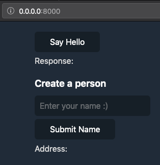
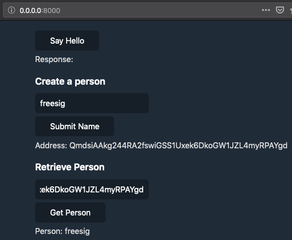

\#S:EXTERNAL=rust=hello_me.rs
\#S:EXTERNAL=html=hello_me.html=gui
\#S:EXTERNAL=javascript=hello_me_gui.js=gui
\#S:EXTERNAL=javascript=hello_me_gui.js=gui2
\#S:EXTERNAL=javascript=hello_me.js=test
# Hello Me

!!! tip "Time & Level"
    Time: ~4 hours | Level: Beginner

Welcome to another tutorial in our Core Concepts series. 

Currently, the app we've built returns a constant value, but it would be useful to be able to store data for more complex applications.  

This tutorial builds on the [previous](../hello_gui) tutorial, so go back and complete it if you haven't already.

### What will you learn
You'll learn how to add an entry type to your zome. 
An entry is a piece of data in your source chain that's been validated.
We'll also show you how to define and validate an entry type that represents a person, and to create and read this data through zome calls.
You will also set up tests and your GUI.

### Why it matters
Storing data is at the core of Holochain. 
Holochain's most important job is ensuring agents handle and store data according to the rules of your application.

## Test first

Start by writing a test to make it easy to see when your app is working:

Open up `cc_tuts/test/index.js`.

This is how we left the testing scenario in the [Hello Test](../hello_test) tutorial:

\#S:MODE=test
\#S:SKIP
```javascript
orchestrator.registerScenario("Test hello holo", async (s, t) => {
  const { alice } = await s.players({alice: config}, true)
  
  const result = await alice.call('cc_tuts', "hello", "hello_holo", {});
  t.ok(result.Ok);
  t.deepEqual(result, { Ok: 'Hello Holo' })
  
  // <---- Put your new tests here
})
```
\#S:INCLUDE,HIDE
```javascript
orchestrator.registerScenario("Test hello holo", async (s, t) => {
  const { alice } = await s.players({alice: config}, true)
  
  const result = await alice.call('cc_tuts', "hello", "hello_holo", {});
  t.ok(result.Ok);
  t.deepEqual(result, { Ok: 'Hello Holo' })
  
```
The new tests go below `t.deepEqual(result, { Ok: 'Hello Holo' })` 
The following test will create an entry with the name ‘Alice’, retrieve the same entry, and check that it has the name ‘Alice’.

Add a call to the `create_person` function with a person named Alice:

```javascript
  const create_result = await alice.call('cc_tuts', "hello", "create_person", {"person": { "name" : "Alice" }});
```

Check that the result of the call is Ok:

```javascript
  t.ok(create_result.Ok);
  const alice_person_address = create_result.Ok;
```

Tell the test to wait for the DHT to become consistent.

```javascript

  await s.consistency()

```

Add a call to the `retrieve_person` function with the address from the last call:

```javascript
  const retrieve_result = await alice.call('cc_tuts', "hello", "retrieve_person", {"address": alice_person_address });
```

Check that this call is Ok as well:

```javascript
  t.ok(retrieve_result.Ok);
```
This is the actual result we want at the end of the test. Check that the entry at the address is indeed named `Alice`:

```javascript
  t.deepEqual(retrieve_result, { Ok: {"name": "Alice"} })
```
\#S:HIDE
```javascript

})

orchestrator.run()
```

### Run sim2h
Again, you will need to run the sim2h server in a separate terminal window:

!!! note "Run in `nix-shell https://holochain.love`"
    ```bash
    sim2h_server -p 9000
    ```

### Running the test
Your test should now look like this:

\#S:CHECK=javascript=test

Obviously, right now, these tests will fail. Can you guess what the first failure will be? Let's have a look.

Enter the nix-shell if you don't already have it open:

```bash
nix-shell https://holochain.love
```

Run the test:

!!! note "Run in `nix-shell https://holochain.love`"
    ```bash
    hc test
    ```

!!! failure "The test fails on the create_person function because it doesn't exist yet:"
    `"Holochain Instance Error: Zome function 'create_person' not found in Zome 'hello'"`

> Note: This test might actually get stuck because we haven't put in the required functions yet. Press `ctrl-c` to exit a stuck test.

## Add the entry

Open up your `zomes/hello/code/src/lib.rs` file.  
To add an entry to your source chain, begin by telling Holochain what kind of entry exists.  
First, we'll create a [`struct`](https://doc.rust-lang.org/1.9.0/book/structs.html) to define the shape of the data.

We will add a `Person` struct in a moment, but this is where to put it:

\#S:SKIP
```rust
// <---- Add the person struct here.

#[zome]
mod hello_zome {
```

Add the following lines:

Allow this struct to be easily converted to and from JSON:

\#S:INCLUDE
```rust
#[derive(Serialize, Deserialize, Debug, DefaultJson, Clone)]
```

Represent a person as a struct:

```rust
pub struct Person {
```

Represent their name as a string:

```rust
    name: String,
}
```

Look for the following lines inside the `hello_zome` mod:

```rust
#[zome]
mod hello_zome {
```
\#S:HIDE
```rust
    #[init]
    fn init() {
        Ok(())
    }

    #[validate_agent]
    pub fn validate_agent(validation_data: EntryValidationData<AgentId>) {
        Ok(())
    }
```
```rust
  /* --- Lines omitted -- */
  #[zome_fn("hc_public")]
  fn hello_holo() -> ZomeApiResult<String> {
      Ok("Hello Holo".into())
  }

  // <---- Add the following lines here.
```

Add the `person_entry_def` function, which tells Holochain about the person entry type:

```rust
    #[entry_def]
    fn person_entry_def() -> ValidatingEntryType {
```

Add the `entry!` macro, which lets you easily create a `ValidatingEntryType`:

```rust
        entry!(
```

To be consistent, give it the same name as the `Person` struct. Entry types are usually in lowercase.

Add the name and description of the entry:

```rust
            name: "person",
            description: "Person to say hello to",
```

Entries of this type are just for this agent's eyes only, so set the entry sharing to private:

```rust
            sharing: Sharing::Private,
```

Add the `validation_package` function that says what is needed to validate this entry:

```rust
            validation_package: || {
                hdk::ValidationPackageDefinition::Entry
            },
```

Add the `validation` function that validates this entry.

As long as it fits the shape of the `Person` struct, it returns that this entry is always Ok:

```rust
            validation: | _validation_data: hdk::EntryValidationData<Person>| {
                Ok(())
            }
        )
    }
```

Now, you can create actual `person` entries and store them on your source chain.

> __Note:__
> Validation is very important. It's the "rules of the game" for your Holochain app. It is meaningful to emphasize that although we are returning `Ok(())`, we're still validating that the data type checks as a `Person` with a `name` property containing a `String`. Essentially, this rule says that the person entry must be in this format.

### Adding `use` statements

In the above code, we just used a few types and macros that are not mentioned anywhere else, so the Rust compiler doesn't know where to find them yet.

Add the following `use` statements:

<script id="asciicast-Smv3xxADtSj8AExf3X9d3UApI" src="https://asciinema.org/a/Smv3xxADtSj8AExf3X9d3UApI.js" async data-autoplay="true"></script>

```diff
#![feature(proc_macro_hygiene)]
+#[macro_use]
extern crate hdk;
extern crate hdk_proc_macros;
extern crate serde;
#[macro_use]
extern crate serde_derive;
extern crate serde_json;
+#[macro_use]
extern crate holochain_json_derive;

use hdk::{
+    entry_definition::ValidatingEntryType,
    error::ZomeApiResult,
};

+use hdk::holochain_core_types::{
+    entry::Entry,
+    dna::entry_types::Sharing,
+};
+
+use hdk::holochain_json_api::{
+    json::JsonString,
+    error::JsonError,
+};
+
+  use hdk::holochain_persistence_api::{
+    cas::content::Address
+};

use hdk_proc_macros::zome;
```

\#S:EXTRA
```
    }
```

\#S:CHECK=rust

## Create a person

You now need a way for your UI to actually create a person entry. Holochain has a concept called `hc_public`, which is a way of telling the runtime to make this function available to call from outside the zome.

Add the following lines below the previous `person_entry_def` function:

Add a public function that takes a `Person` and returns a result with an `Address`:

\#S:INCLUDE
```rust
    #[zome_fn("hc_public")]
    pub fn create_person(person: Person) -> ZomeApiResult<Address> {
```

Create an entry from the person argument:

```rust
        let entry = Entry::App("person".into(), person.into());
```

Commit the entry to your local source chain:

```rust
        let address = hdk::commit_entry(&entry)?;
```

Return the `Ok` result with the new person entry's address:

```rust
        Ok(address)
    }
```

### Compile

\#S:EXTRA
```
    }
```
\#S:CHECK=rust

Check for compile errors again:

!!! note "Run in `nix-shell https://holochain.love`"
    ```bash
    hc package
    ```

## Retrieve person

Lastly, you need a way for your UI to get a person entry back from the source chain.

Add the following lines below the `create_person` function:

Add a public `retrieve_person` function that takes an `Address` and returns a `Person`:

```rust
    #[zome_fn("hc_public")]
    fn retrieve_person(address: Address) -> ZomeApiResult<Person> {
```

Get the entry from your local storage, asking for it by address, and convert it to a Person type:

```rust
        hdk::utils::get_as_type(address)
    }
```

\#S:HIDE,INCLUDE
```rust
}
```
> In Rust, the last line is always returned---you do not need to explicitly say `return`---just leave off the `;`.

### Test

\#S:CHECK=rust

Instead of directly compiling, you can run the test you wrote at the start (the test always compiles before it runs):

!!! note "Run in `nix-shell https://holochain.love`"
    ```bash
    hc test
    ```

!!! success "If everything went smoothly you will see:"
    ```bash
    # tests 5
    # pass  5
    
    # ok
    ```

## UI

Now that the back end is working, you can modify the UI to interact with zome functions you created. First, let's do some housekeeping and move the JavaScript from the previous tutorial into its own file.

Go to the GUI project folder you created in the [Hello GUI](../hello_gui) tutorial:

```bash
cd holochain/coreconcepts/gui
```

Create a new `hello.js` file, open it in your favorite editor, and open the `index.html` alongside it.

Move everything inside the `<script>` tag into the `hello.js`:

\#S:SKIP,MODE=gui
```diff
--- index.html
<script type="text/javascript">
-    var holochain_connection = holochainclient.connect({ url: "ws://localhost:3401"});
-    
-    function hello() {
-      holochain_connection.then(({callZome, close}) => {
-        callZome('test-instance', 'hello', 'hello_holo')({"args": {} }).then((result) => update_span(result))
-      })
-    }
-    function show_output(result) {
-      var span = document.getElementById('output');
-      var output = JSON.parse(result);
-      span.textContent = " " + output.Ok;
-    }
</script>

+++ hello.js
+var holochain_connection = holochainclient.connect({ url: "ws://localhost:3401"});
+
+function hello() {
+  holochain_connection.then(({callZome, close}) => {
+    callZome('test-instance', 'hello', 'hello_holo')({"args": {} }).then((result) => update_span(result))
+  })
+}
+
+function show_output(result) {
+  var span = document.getElementById('output');
+  var output = JSON.parse(result);
+  span.textContent = " " + output.Ok;
+}
```


Add the `src` attribute to the `<script>` tag:

```html
<script type="text/javascript" src="hello.js"></script>
```
<script id="asciicast-rJ2HMQsrkMnYMiqkW4txPU9F8" src="https://asciinema.org/a/rJ2HMQsrkMnYMiqkW4txPU9F8.js" async data-autoplay="true" data-loop="true"></script>

## Create person UI widget


\#S:INCLUDE

Start by adding the HTML elements to create a person in your `index.html`.

Look for the previous 'say hello' elements.

\#S:SKIP

```html
    <button onclick="hello()" type="button">Say Hello</button>
    <div>Response:</span><span id="output"></div>
    <!-- Put the following lines here -->
```

\#S:INCLUDE
Below them, give the section a heading:
```html
    <h3>Create a person</h3>
```

Add a text box so the user can enter their name:

```html
    <input type="text" id="name" placeholder="Enter your name :)">
```

Add a button that calls a (yet to be written) JavaScript function called `create_person`:

```html
    <button onclick="create_person()" type="button">Submit Name</button>
```

Add a span with the id `address_output` so you can render the result of this call:

```html
    <div>Address: <span id="address_output"></span></div>
```

\#S:EXTRA
```
        <script
          type="text/javascript"
          src="hc-web-client/hc-web-client-0.5.1.browser.min.js"
        ></script>
        <script type="text/javascript" src="hello.js"></script>
      </body>
    </html>
```

\#S:CHECK=html=gui

\#S:MODE=gui2

### Switch to your `hello.js` file


Let's write the `create_person` function that will call your zome.

Add the `create_person` function:

```javascript
function create_person() {
```

Get the text box by its ID `name` and save the current text value into the name variable:

```javascript
  const name = document.getElementById('name').value;
```

Wait for the connection; then make a zome call:

```javascript
  holochain_connection.then(({callZome, close}) => {
```

Call `create_person` in your `hello` zome and pass in the name variable as part of a person structure, then write the result to the console:

```javascript
    callZome('test-instance', 'hello', 'create_person')({
      person: {name: name},
    }).then(result => console.log(result));
  });
}
```

\#S:CHECK=javascript=gui2

### Run the server and open a browser

Let's test your first call.

Open a new terminal window and enter the nix-shell:

```bash
cd holochain/coreconcepts/gui
nix-shell https://holochain.love
```

Run the server:

!!! note "Run in `nix-shell https://holochain.love`"
    ```bash
    python -m SimpleHTTPServer
    ```

In your other terminal window, the one with your back end code, package and run your zome:

!!! note "Run in `nix-shell https://holochain.love`"
    ```bash
    hc package
    ```
    ```bash
    hc run -p 3401
    ```

Now that both your UI server and your Holochain conductor server are running, open up a browser and go to `0.0.0.0:8000`. You should see the HTML elements you created:



Open the developer console, enter your name, and press the "Submit Name" button. You should see something similar to this:


> The address you see will probably be different, because you typed in your own name.

### Show the new entry's address

We're going to show the address on the page now, rather than the developer console.

First, a bit of refactoring---if you make the `show_ouput` function more generic, you can reuse it for each element that shows the output for a zome function.

Pass in the element's ID so that the function can be reused:

```diff
-function show_output(result) {
+function show_output(result, id) {
-  var span = document.getElementById('output');
+  var el = document.getElementById(id);
  var output = JSON.parse(result);
-  span.textContent = ' ' + output.Ok;
+  el.textContent = ' ' + output.Ok;
}

function hello() {
  holochain_connection.then(({callZome, close}) => {
    callZome('test-instance', 'hello', 'hello_holo')({args: {}}).then(result =>
-      show_output(result),
+      show_output(result, id),
    );
  });
}

function create_person() {
  const name = document.getElementById('name').value;
  holochain_connection.then(({callZome, close}) => {
    callZome('test-instance', 'hello', 'create_person')({
      person: {name: name},
-    }).then(result => console.log(result));
+    }).then(result => show_output(result, 'address_output'));
  });
}
```

\#S:HIDE,MODE=gui

```javascript
function create_person() {
  const name = document.getElementById('name').value;
  holochain_connection.then(({callZome, close}) => {
    callZome('test-instance', 'hello', 'create_person')({
      person: {name: name},
    }).then(result => show_output(result, 'address_output'));
  });
}
```

<script id="asciicast-JU3iJOeyEnzCVGLKugBOq2PRn" src="https://asciinema.org/a/JU3iJOeyEnzCVGLKugBOq2PRn.js" async data-autoplay="true" data-loop="true"></script>

### Enter the browser

Go back to your browser and refresh the page. This time, when you enter your name and press __Submit Name__, you will see the address show up:


## Retrieve a person entry and show it in the UI

In the `index.html` file, under the create person section, add a new header:

```html
    <h3>Retrieve Person</h3>
```

Add a text box so the user can enter the address that is returned from the `create_person` function:

```html
    <input type="text" id="address_in" placeholder="Enter the entry address">
```

Add a button that calls the (yet to be written) `retrieve_person` JavaScript function:

```html
    <button onclick="retrieve_person()" type="button">Get Person</button>
```

Add a span with the ID `person_output` to display the person that is returned from the `retrieve_person` function:

```html
    <div>Person: <span id="person_output"></span></div>
```

\#S:HIDE
```html
    <script
      type="text/javascript"
      src="hc-web-client/hc-web-client-0.5.1.browser.min.js"
    ></script>
    <script type="text/javascript" src="hello.js"></script>
  </body>
</html>
```

\#S:CHECK=html=gui


### Go to your `hello.js` file

Add the `retrieve_person` function to call the zome function of the same name and show the response:

```javascript
function retrieve_person() {
```

Get the value from the `address_in` text box:

```javascript
  var address = document.getElementById('address_in').value;
```

Wait for the connection; then make a zome call:

```javascript
  holochain_connection.then(({callZome, close}) => {
```

Call the `retrieve_person` public zome function, passing in the address. Then pass the result to `show_person`:

```javascript
    callZome('test-instance', 'hello', 'retrieve_person')({
      address: address,
    }).then(result => show_person(result, 'person_output'));
  });
}
```

Add the `show_person` function. It is very similar to `show_output`, except that you need to show the name.

```javascript
function show_person(result) {
  var person = document.getElementById('person_output');
  var output = JSON.parse(result);
  person.textContent = ' ' + output.Ok.name;
}
```

\#S:CHECK=javascript=gui

### Enter the browser
Finally, go and test this at `0.0.0.0:8000`.  
You should see something like this:


Well done! You have stored and retrieved data from a private source chain using a GUI!

## Key takeaways
- Entries can be defined using Rust types.
- Entry definitions tell Holochain about the data it can hold and how to validate it.
- Once an entry is committed this can never be undone, and any other agent running the same DNA will always commit an entry that has passed validation. _(This means validation must be deterministic.)_
- The zome returns entries in the JSON format.

## Learn more
- [JSON](http://www.json.org/)
- [Struct](https://doc.rust-lang.org/book/ch05-00-structs.html)
- [CALM](http://bloom-lang.net/calm/)
